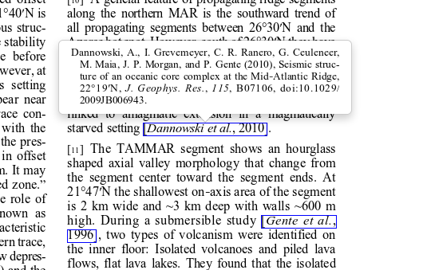

 <h1>Coordinates of structures in the original PDF</h1>

## Getting the coordinates of identified structures

### Limitations

Since April 2017, GROBID version 0.4.2 and higher, coordinate areas can be obtained for the following document substructures: 

* ```ref``` for bibliographical, figure, table and formula reference markers - for example (_Toto and al. 1999_), see _Fig. 1_, as shown by _formula (245)_, etc.,
* ```biblStruct``` for a bibliographical reference,
* ```persName``` for a complete author name,
* ```figure``` for figure AND table,
* ```formula``` for mathematical equations,
* ```head``` for section titles,
* ```s``` for optional sentence structure (the GROBID fulltext service must be called with the `segmentSentences` parameter to provide the optional sentence-level elements),
* ```note``` for foot note elements. 

However, there is normally no particular limitation to the type of structures which can have their coordinates in the results, the implementation is on-going, see [issue #69](https://github.com/kermitt2/grobid/issues/69), and it is expected that more or less any structures could be associated with their coordinates in the orginal PDF. 

Coordinates are currently available in full text processing (returning a TEI document) and the PDF annotation services (returning JSON for `ref`, `figure` and `formula` only). 

### GROBID service

To get the coordinates of certain structures extracted from a PDF document, use in the query the parameter ```teiCoordinates``` with the list of structures than should have coordinates in the results. Possible structures are indicated above. 

Example with cURL:

* add coordinates to the figures (and tables) only:

```bash
> curl -v --form input=@./12248_2011_Article_9260.pdf --form teiCoordinates=figure --form teiCoordinates=biblStruct localhost:8070/api/processFulltextDocument
```

* add coordinates for all the supported elements (sorry for the ugly cURL syntax on this):

```bash
> curl -v --form input=@./12248_2011_Article_9260.pdf --form teiCoordinates=persName --form teiCoordinates=figure --form teiCoordinates=ref --form teiCoordinates=biblStruct --form teiCoordinates=formula localhost:8070/api/processFulltextDocument
```

### Batch processing

We recommand to use the above service mode for best performance and range of options. 

Generating coordinates can also been obtained with the batch mode by adding the parameter ```-teiCoordinates``` with the command ```processFullText```.

Example (under the project main directory `grobid/`): 

```bash
> java -Xmx1024m -Djava.library.path=grobid-home/lib/lin-64:grobid-home/lib/lin-64/jep -jar grobid-core/build/libs/grobid-core-0.5.0-onejar.jar -gH grobid-home -dIn /path/to/input/directory -dOut /path/to/output/directory -teiCoordinates -exe processFullText 
```

See the [batch mode details](https://grobid.readthedocs.io/en/latest/Grobid-batch/#processfulltext). With the batch mode, it is currenlty not possible to cherry pick up certain elements, coordinates will appear for all. Again, we recommend to use the service for significantly better performances and more customization options. 

## Coordinate system in the PDF

### Generalities

The PDF coordinates system has three main characteristics: 

* contrary to usage, the origin of a document is at the upper left corner. The x-axis extends to the right and the y-axis extends downward,

* all locations and sizes are stored in an abstract value called a PDF unit,

* PDF documents do not have a resolution: to convert a PDF unit to a physical value such as pixels, an external value must be provided for the resolution.

In addition, contrary to usage in computer science, the index associated to the first page is 1 (not 0).

### Coordinates in JSON results

The processing of a PDF document by the GROBID result in JSON containing two specific structures for positioning entity annotations in the PDF :

* the list of page size, introduced by the JSON attribute `pages`. The dimension of each page is given successively by two attributes `page_height` and `page_height`.

Example: 
```json
	"pages": [  {"page_height":792.0, "page_width":612.0}, 
 				{"page_height":792.0, "page_width":612.0}, 
				{"page_height":792.0, "page_width":612.0}  ]
```

* for each entity, a json attribute `pos` introduces a __list of bounding boxes__ to identify the area of the annotation corresponding to the entity. Several bounding boxes might be necessary because a textual mention does not need to be a rectangle, but the union of rectangles (a union of bounding boxes), for instance when a mention to be annotated is on several lines.

Example: 
```json
"pos": [{  "p": 1,
			"x": 20,
			"y": 20,
			"h": 10,
			"w": 30 }, 
		{  "p": 1,
			"x": 30,
			"y": 20,
			"h": 10,
			"w": 30 } ]
```

A __bounding box__ is defined by the following attributes: 

- `p`: the number of the page (beware, in the PDF world the first page has index 1!), 

- `x`: the x-axis coordinate of the upper-left point of the bounding box,

- `y`: the y-axis coordinate of the upper-left point of the bounding box (beware, in the PDF world the y-axis extends downward!),

- `h`: the height of the bounding box,

- `w`: the width of the bounding box.

These JSON annotations target browser applications. As a PDF document expresses value in abstract PDF unit and does not have resolution, the coordinates have to be converted into the scale of the PDF layout used by the client/browser (usually in pixels). This is why the dimension of the pages are necessary for the correct scaling, taking into account that, in a PDF document, pages can be of different size. 

The GROBID console offers a reference implementation with PDF.js for dynamically positioning structure annotations on a processed PDF rendered on a web browser:




### Coordinates in TEI/XML results

Coordinates for a given structure appear via an extra attribute ```@coord```. This is part of the [customization to the TEI](TEI-encoding-of-results.md) used by GROBID.

* the list of page size is encoded under the TEI element `<facsimile>`. The dimension of each page is given successively by the TEI attributes `@lrx` and `@lry` of the element `<surface>` to be conformant with the TEI (`@ulx` and `@uly` are used to set the orgine coordinates, which is always `(0,0)` for us).

Example: 


```xml
	...
	</teiHeader>
	<facsimile>
		<surface n="1" ulx="0.0" uly="0.0" lrx="612.0" lry="794.0"/>
		<surface n="2" ulx="0.0" uly="0.0" lrx="612.0" lry="794.0"/>
		<surface n="3" ulx="0.0" uly="0.0" lrx="612.0" lry="794.0"/>
		<surface n="4" ulx="0.0" uly="0.0" lrx="612.0" lry="794.0"/>
		<surface n="5" ulx="0.0" uly="0.0" lrx="612.0" lry="794.0"/>
	</facsimile>
	<text xml:lang="en">
	...
```

* for each entity, similarly as for JSON, the coordinates of a structure is provided as a list of bounding boxes, each one separated by a semicolon ```;```, each bounding box being defined by 5 attributes separated by a comma ```,```:

Example 1: 
```xml
<author>
	<persName coords="1,53.80,194.57,58.71,9.29">
		<forename type="first">Ron</forename>
		<forename type="middle">J</forename>
		<surname>Keizer</surname>
	</persName>
</author>
```

"1,53.80,194.57,58.71,9.29" indicates one bounding box with attributes page=1, x=53.80, y=194.57, w=58.71, h=9.29.

Example 2:
```xml
<biblStruct coords="10,317.03,183.61,223.16,7.55;10,317.03,192.57,223.21,7.55;10,317.03,201.53,223.15,7.55;10,317.03,210.49,52.22,7.55"  xml:id="b19">
```

The above ```@coords``` XML attributes introduces 4 bounding boxes to define the area of the bibliographical reference (typically because the reference is on several line).

As side note, in traditionnal TEI encoding an area should be expressed using SVG. However it would have make the TEI document quickly unreadable and extremely heavy and we are using this more compact notation. 
