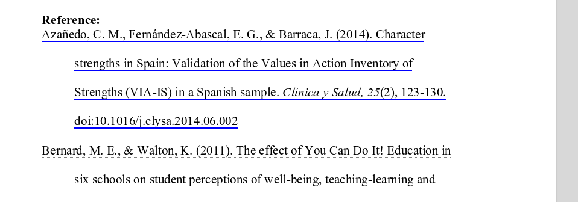

# GROBID Service API

The GROBID Web API provides a simple and efficient way to use the tool. A service console is available to test GROBID in a human friendly manner. For production and benchmarking, we strongly recommand to use this web service mode on a multi-core machine and to avoid running GROBID in the batch mode.  

## Start the server with Gradle

Go under the `grobid/` main directory. Be sure that the GROBID project is built, see [Install GROBID](Install-Grobid.md).

The following command will start the server on the default port __8070__:

```console
./gradlew run
```

(the Gradle process will hang at something like 88%, this is normal because the web service is ran sharing the same JVM as Gradle)

## Install and run the service as standalone application

You could also build and install the service as a standalone service (let's supposed the destination directory is grobid-installation) 

```console
./gradlew clean assemble
cd ..
mkdir grobid-installation
cd grobid-installation
unzip ../grobid/grobid-service/build/distributions/grobid-service-0.7.2.zip
mv grobid-service-0.7.2 grobid-service
unzip ../grobid/grobid-home/build/distributions/grobid-home-0.7.2.zip
./grobid-service/bin/grobid-service
```

The directory `grobid-installation` should have the following structure:

```text
.
├── grobid-home
└── grobid-service
```

## Service checks

You can check whether the service is up and running by opening the following URL:

* <http://yourhost:8070/api/version> will return you the current version
* <http://yourhost:8070/api/isalive> will return `true`/`false` whether the service is up and running

The service provides also an admin console, reachable at <http://yourhost:8071> where some additional checks like ping, metrics, hearthbeat are available.
We recommend, in particular to have a look at the metrics (using the [Metric library](https://metrics.dropwizard.io/3.1.0/getting-started/)) which are providing the rate of execution as well as the throughput of each entry point.

In addition, [Prometheus](https://prometheus.io/) format export metrics are available at <http://yourhost:8071/metrics/prometheus>.  

## Configure the server

If required, modify the file under `grobid/grobid-home/config/grobid.yaml` for starting the server on a different port or if you need to change the absolute path to your `grobid-home` (e.g. when running on production). By default `grobid-home` is located under `grobid/grobid-home`. `grobid-home` contains all the models and static resources required to run GROBID.

### Model loading strategy 
You can choose to load all the models at the start of the service or lazily when a model is used the first time, the latter being the default. 
Loading all models at service startup will slow down the start of the server and will use more memories than the lazy mode in case only a few services will be used. 

For preloading all the models, set the following config parameter to `true`:

```yaml
grobid:
  # for **service only**: how to load the models, 
  # false -> models are loaded when needed (default), avoiding putting in memory useless models but slow down significantly
  #          the service at first call
  # true -> all the models are loaded into memory at the server startup, slow the start of the services and models not
  #         used will take some memory, but server is immediatly warm and ready
  modelPreload: false
```  

## CORS (Cross-Origin Resource Share)

By default, Grobid allows API access from any origin.
The configuration can be modified, for example to restrict origin, methods and header of access, through the YAML configuration file `grobid-home/config/grobid.yaml`:

```yaml
grobid:
  corsAllowedOrigins: "grobid.com"
  corsAllowedMethods: "OPTIONS,GET,PUT,POST,DELETE,HEAD"
  corsAllowedHeaders: "X-Requested-With,Content-Type,Accept,Origin"  
```

## Clients for GROBID Web Services

We provide clients written in Python, Java, node.js using the GROBID PDF-to-TEI conversion Web services for parallel batch processing:

* <a href="https://github.com/kermitt2/grobid-client-python" target="_blank">Python GROBID client</a>
* <a href="https://github.com/kermitt2/grobid-client-java" target="_blank">Java GROBID client</a>
* <a href="https://github.com/kermitt2/grobid-client-node" target="_blank">Node.js GROBID client</a>

All these clients will take advantage of the multi-threading for scaling PDF batch processing. As a consequence, they will be much more efficient than the [batch command lines](Grobid-batch.md) (which use only one thread) and should be prefered. 

## Use GROBID test console

On your browser, the welcome page of the Service console is available at the URL <http://localhost:8070>.

On the console, the RESTful API can be tested under the `TEI` tab for service returning a TEI document, under the `PDF` tab for services returning annotations relative to PDF or an annotated PDF and under the `Patent` tab for patent-related services:


The services returning JSON results for dynamic PDF annotation purposes can be tested under the `PDF` tab. The PDF is rendered with [PDF.js] and the console javascript offers a reference implementation on how to use the returned annotations with coordinates for web application,


Still to demostrate [PDF.js] annotation possibilities, by default bibliographical reference for which a DOI (or arXiv ID) is extracted or found by consolidation are made clickable on the original rendered PDF:



## GROBID Web Services

We describe bellow the provided resources corresponding to the HTTP verbs, to use the grobid web services. All url described bellow are relative path, the root url is `http://<server instance name>/<root context>`

The consolidation parameters (`consolidateHeader` and `consolidateCitations`) indicate if GROBID should try to complete the extracted metadata with an additional external call to [CrossRef API](https://github.com/CrossRef/rest-api-doc). The CrossRef look-up is realized based on the reliable subset of extracted metadata which are supported by this API. Each consolidation parameter is a string which can have three values:

* `0`, means no consolidation at all is performed: all the metadata will come from the source PDF
* `1`, means consolidation against CrossRef and update of metadata: when we have a DOI match, the publisher metadata are combined with the metadata extracted from the PDF, possibly correcting them
* `2`, means consolidation against CrossRef and, if matching, addition of the DOI only

### PDF to TEI conversion services

#### /api/processHeaderDocument

Extract the header of the input PDF document, normalize it and convert it into a TEI XML or [BibTeX] format.

`consolidateHeader` is a string of value `0` (no consolidation), `1` (consolidate and inject all extra metadata, default value), or `2` (consolidate the citation and inject DOI only).

|  method   |  request type         |  response type       |  parameters         |  requirement  |  description  |
|---        |---                    |---                   |---                  |---            |---            |
| POST, PUT | `multipart/form-data` | `application/xml`    | `input`             | required      | PDF file to be processed |
|           |                       |                      | `consolidateHeader` | optional      | consolidateHeader is a string of value `0` (no consolidation), `1` (consolidate and inject all extra metadata, default value), `2` (consolidate the citation and inject DOI only), or `3` (consolidate  using only extracted DOI - if extracted) . |
|           |                       |                      | `includeRawAffiliations` | optional | `includeRawAffiliations` is a boolean value, `0` (default, do not include raw affiliation string in the result) or `1` (include raw affiliation string in the result).  |

Use `Accept: application/x-bibtex` to retrieve BibTeX format instead of TEI (note: the TEI XML format is much richer, it should be preferred if there is no particular reason to use BibTeX).

Response status codes:

|     HTTP Status code |   reason                                               |
|---                   |---                                                     |
|         200          |     Successful operation.                              |
|         204          |     Process was completed, but no content could be extracted and structured |
|         400          |     Wrong request, missing parameters, missing header  |
|         500          |     Indicate an internal service error, further described by a provided message           |
|         503          |     The service is not available, which usually means that all the threads are currently used                       |

A `503` error with the default parallel mode normally means that all the threads available to GROBID are currently used. The client need to re-send the query after a wait time that will allow the server to free some threads. The wait time depends on the service and the capacities of the server, we suggest 2 seconds for the `processHeaderDocument` service.

You can test this service with the **cURL** command lines, for instance header extraction from a PDF file in the current directory:

```console
curl -v --form input=@./thefile.pdf localhost:8070/api/processHeaderDocument
```

If you want a simpler result in the BibTeX format:

```console
curl -v -H "Accept: application/x-bibtex" --form input=@./thefile.pdf localhost:8070/api/processHeaderDocument
```

#### /api/processFulltextDocument

Convert the complete input document into TEI XML format (header, body and bibliographical section).

|  method   |  request type         |  response type       |  parameters            |  requirement  |  description  |
|---        |---                    |---                   |---                     |---            |---            |
| POST, PUT | `multipart/form-data` | `application/xml`    | `input`                | required      | PDF file to be processed |
|           |                       |                      | `consolidateHeader`    | optional      | `consolidateHeader` is a string of value `0` (no consolidation), `1` (consolidate and inject all extra metadata, default value), `2` (consolidate the citation and inject DOI only), or `3` (consolidate  using only extracted DOI - if extracted). |
|           |                       |                      | `consolidateCitations` | optional      | `consolidateCitations` is a string of value `0` (no consolidation, default value) or `1` (consolidate and inject all extra metadata), or `2` (consolidate the citation and inject DOI only). |
|           |                       |                      | `includeRawCitations`  | optional      | `includeRawCitations` is a boolean value, `0` (default, do not include raw reference string in the result) or `1` (include raw reference string in the result). |
|           |                       |                      | `includeRawAffiliations` | optional | `includeRawAffiliations` is a boolean value, `0` (default, do not include raw affiliation string in the result) or `1` (include raw affiliation string in the result).  |
|           |                       |                      | `teiCoordinates`       | optional      | list of element names for which coordinates in the PDF document have to be added, see [Coordinates of structures in the original PDF](Coordinates-in-PDF.md) for more details |
|           |                       |                      | `segmentSentences`       | optional      | Paragraphs structures in the resulting TEI will be further segmented into sentence elements <s> |
|           |                       |                      | `start`       | optional      | Start page number of the PDF to be considered, previous pages will be skipped/ignored, integer with first page starting at `1`, (default `-1`, start from the first page of the PDF)  |
|           |                       |                      | `end`       | optional      | End page number of the PDF to be considered, next pages will be skipped/ignored, integer with first page starting at `1` (default `-1`, end with the last page of the PDF)  |

Response status codes:

|     HTTP Status code |   reason                                               |
|---                   |---                                                     |
|         200          |     Successful operation.                              |
|         204          |     Process was completed, but no content could be extracted and structured |
|         400          |     Wrong request, missing parameters, missing header  |
|         500          |     Indicate an internal service error, further described by a provided message           |
|         503          |     The service is not available, which usually means that all the threads are currently used                       |

A `503` error with the default parallel mode normally means that all the threads available to GROBID are currently used. The client need to re-send the query after a wait time that will allow the server to free some threads. The wait time depends on the service and the capacities of the server, we suggest 5-10 seconds for the `processFulltextDocument` service.

The optional sentence segmentation in the TEI XML result is based on the algorithm selected in the Grobid configuration file (under `grobid-home/config/grobid.yaml`). As of August 2020, available segmenters are [OpenNLP sentence detector](https://opennlp.apache.org/docs/1.5.3/manual/opennlp.html#tools.sentdetect) (recommended for scientific articles after evaluation) and the [Pragmatic_Segmenter](https://github.com/diasks2/pragmatic_segmenter).

You can test this service with the **cURL** command lines, for instance fulltext extraction (header, body and citations) from a PDF file in the current directory:

```console
curl -v --form input=@./thefile.pdf localhost:8070/api/processFulltextDocument
```

fulltext extraction and add coordinates to the figures (and tables) only:

```console
curl -v --form input=@./12248_2011_Article_9260.pdf --form teiCoordinates=figure --form teiCoordinates=biblStruct localhost:8070/api/processFulltextDocument
```

fulltext extraction and add coordinates for all the supported coordinate elements (sorry for the ugly cURL syntax on this, but that's how cURL is working!):

```console
curl -v --form input=@./12248_2011_Article_9260.pdf --form teiCoordinates=persName --form teiCoordinates=figure --form teiCoordinates=ref --form teiCoordinates=biblStruct --form teiCoordinates=formula localhost:8070/api/processFulltextDocument
```

Regarding the bibliographical references, it is possible to include the original raw reference string in the parsed bibliographical result with the parameter `includeRawCitations` set to `1`:

```console
curl -v --form input=@./thefile.pdf --form includeRawCitations=1 localhost:8070/api/processFulltextDocument
```

Example with requested additional sentence segmentation of the paragraph with bounding box coordinates of the sentence structures:

```console
curl -v --form input=@./0thefile.pdf  --form segmentSentences=1 --form teiCoordinates=s localhost:8070/api/processFulltextDocument
```

Example for processing a given PDF from page 3 (included) to the last page (page 1 and 2 will be ignored, by convention the index of the first page of a PDF is `1`):

```console
curl -v --form input=@./thefile.pdf --form start=3 localhost:8070/api/processFulltextDocument
```

#### /api/processReferences

Extract and convert all the bibliographical references present in the input document into TEI XML or [BibTeX] format.

|  method   |  request type         |  response type     |  parameters            |  requirement  |  description  |
|---        |---                    |---                 |---                     |---            |---            |
| POST, PUT | `multipart/form-data` | `application/xml`  | `input`                | required      | PDF file to be processed |
|           |                       |                    | `consolidateCitations` | optional      | `consolidateCitations` is a string of value `0` (no consolidation, default value) or `1` (consolidate and inject all extra metadata), or `2` (consolidate the citation and inject DOI only). |
|           |                       |                    | `includeRawCitations`  | optional      | `includeRawCitations` is a boolean value, `0` (default. do not include raw reference string in the result) or `1` (include raw reference string in the result). |

Use `Accept: application/x-bibtex` to retrieve BibTeX instead of TEI.

Response status codes:

|     HTTP Status code |   reason                                               |
|---                   |---                                                     |
|         200          |     Successful operation.                              |
|         204          |     Process was completed, but no content could be extracted and structured |
|         400          |     Wrong request, missing parameters, missing header  |
|         500          |     Indicate an internal service error, further described by a provided message           |
|         503          |     The service is not available, which usually means that all the threads are currently used                       |

A `503` error with the default parallel mode normally means that all the threads available to GROBID are currently used. The client need to re-send the query after a wait time that will allow the server to free some threads. The wait time depends on the service and the capacities of the server, we suggest 3-6 seconds for the `processReferences` service.

You can test this service with the **cURL** command lines, for instance extraction and parsing of all references from a PDF in the current directory without consolidation (default value):

```console
curl -v --form input=@./thefile.pdf localhost:8070/api/processReferences
```

It is possible to include the original raw reference string in the parsed result with the parameter `includeRawCitations` set to `1`:

```console
curl -v --form input=@./thefile.pdf --form includeRawCitations=1 localhost:8070/api/processReferences
```

### Raw text to TEI conversion services

#### /api/processDate

Parse a raw date string and return the corresponding normalized date in ISO 8601 embedded in a TEI fragment.

|   method	|  request type 	  | response type 		 |  parameters 	| requirement  	|   description				|
|---		|---				  |---					 |---			|---			|--- 						|
| POST, PUT	| application/x-www-form-urlencoded | application/xml  	| date | required	| date to be parsed as raw string|

Response status codes:

|     HTTP Status code |   reason                                               |
|---                   |---                                                     |
|         200          |     Successful operation.                              |
|         204          |     Process was completed, but no content could be extracted and structured |
|         400          |     Wrong request, missing parameters, missing header  |
|         500          |     Indicate an internal service error, further described by a provided message           |
|         503          |     The service is not available, which usually means that all the threads are currently used                       |

A `503` error with the default parallel mode normally means that all the threads available to GROBID are currently used. The client need to re-send the query after a wait time that will allow the server to free some threads. The wait time depends on the service and the capacities of the server, we suggest 1 second for the `processDate` service.

You can test this service with the **cURL** command lines, for instance parsing of a raw date string:

```console
curl -X POST -d "date=September 16th, 2001" localhost:8070/api/processDate
```

which will return:

```xml
<date when="2001-9-16" />
```

#### /api/processHeaderNames

Parse a raw string corresponding to a name or a sequence of names from a header section and return the corresponding normalized authors in TEI format.

|   method	|  request type 	  | response type 		 |  parameters 	| requirement  	|   description				|
|---		|---				  |---					 |---			|---			|--- 						|
| POST, PUT	| application/x-www-form-urlencoded | application/xml  	| names | required	| sequence of names to be parsed as raw string|

Response status codes:

|     HTTP Status code |   reason                                               |
|---                   |---                                                     |
|         200          |     Successful operation.                              |
|         204          |     Process was completed, but no content could be extracted and structured |
|         400          |     Wrong request, missing parameters, missing header  |
|         500          |     Indicate an internal service error, further described by a provided message           |
|         503          |     The service is not available, which usually means that all the threads are currently used                       |

A `503` error with the default parallel mode normally means that all the threads available to GROBID are currently used. The client need to re-send the query after a wait time that will allow the server to free some threads. The wait time depends on the service and the capacities of the server, we suggest 1 second for the `processHeaderNames` service.

You can test this service with the **cURL** command lines, for instance parsing of a raw sequence of header names string:

```console
curl -X POST -d "names=John Doe and Jane Smith" localhost:8070/api/processHeaderNames
```

which will return:

```xml
<persName xmlns="http://www.tei-c.org/ns/1.0">
  <forename type="first">John</forename>
  <surname>Doe</surname>
</persName>
<persName xmlns="http://www.tei-c.org/ns/1.0">
  <forename type="first">Jane</forename>
  <surname>Smith</surname>
</persName>
```

#### /api/processCitationNames

Parse a raw sequence of names from a bibliographical reference and return the corresponding normalized authors in TEI format.

|   method	|  request type 	  | response type 		 |  parameters 	| requirement  	|   description				|
|---		|---				  |---					 |---			|---			|--- 						|
| POST, PUT	| application/x-www-form-urlencoded | application/xml  	| names | required	| sequence of names to be parsed as raw string|

Response status codes:

|     HTTP Status code |   reason                                               |
|---                   |---                                                     |
|         200          |     Successful operation.                              |
|         204          |     Process was completed, but no content could be extracted and structured |
|         400          |     Wrong request, missing parameters, missing header  |
|         500          |     Indicate an internal service error, further described by a provided message           |
|         503          |     The service is not available, which usually means that all the threads are currently used                       |

A `503` error with the default parallel mode normally means that all the threads available to GROBID are currently used. The client need to re-send the query after a wait time that will allow the server to free some threads. The wait time depends on the service and the capacities of the server, we suggest 1 second for the `processCitationNames` service.

You can test this service with the **cURL** command lines, for instance parsing of a raw sequence of citation names string:

```console
curl -X POST -d "names=J. Doe, J. Smith and B. M. Jackson" localhost:8070/api/processCitationNames
```

which will return:

```xml
<persName xmlns="http://www.tei-c.org/ns/1.0">
    <forename type="first">J</forename>
    <surname>Doe</surname>
</persName>
<persName xmlns="http://www.tei-c.org/ns/1.0">
    <forename type="first">J</forename>
    <surname>Smith</surname>
</persName>
<persName xmlns="http://www.tei-c.org/ns/1.0">
    <forename type="first">B</forename>
    <forename type="middle">M</forename>
    <surname>Jackson</surname>
</persName>
```

#### /api/processAffiliations

Parse a raw sequence of affiliations/addresses with or without address and return the corresponding normalized affiliations with address in TEI format.

|   method	|  request type 	  | response type 		 |  parameters 	| requirement  	|   description				|
|---		|---				  |---					 |---			|---			|--- 						|
| POST, PUT	| application/x-www-form-urlencoded | application/xml  	| affiliations | required	| sequence of affiliations+addresses to be parsed as raw string|

Response status codes:

|     HTTP Status code |   reason                                               |
|---                   |---                                                     |
|         200          |     Successful operation.                              |
|         204          |     Process was completed, but no content could be extracted and structured |
|         400          |     Wrong request, missing parameters, missing header  |
|         500          |     Indicate an internal service error, further described by a provided message           |
|         503          |     The service is not available, which usually means that all the threads are currently used                       |

A `503` error with the default parallel mode normally means that all the threads available to GROBID are currently used. The client need to re-send the query after a wait time that will allow the server to free some threads. The wait time depends on the service and the capacities of the server, we suggest 1 second for the `processAffiliations` service.

You can test this service with the **cURL** command lines, for instance parsing of a raw affiliation string:

```console
curl -X POST -d "affiliations=Stanford University, California, USA" localhost:8070/api/processAffiliations
```

which will return:

```xml
<affiliation>
    <orgName type="institution">Stanford University</orgName>
    <address>
        <region>California</region>
        <country key="US">USA</country>
    </address>
</affiliation>
```

#### /api/processCitation

Parse a raw bibliographical reference (in isolation) and return the corresponding normalized bibliographical reference in TEI XML or [BibTeX] format.

|  method   |  request type         |  response type    |  parameters            |  requirement  |  description  |
|---        |---                    |---                |---                     |---            |---            |
| POST, PUT | `application/x-www-form-urlencoded` | `application/xml` | `citations`            | required      | bibliographical reference to be parsed as raw string |
|           |                       |                   | `consolidateCitations` | optional      | `consolidateCitations` is a string of value `0` (no consolidation, default value) or `1` (consolidate and inject all extra metadata), or `2` (consolidate the citation and inject DOI only). |
|           |                       |                   | `includeRawCitations`  | optional      | `includeRawCitations` is a boolean value, `0` (default. do not include raw reference string in the result) or `1` (include raw reference string in the result). |

Use `Accept: application/x-bibtex` to retrieve BibTeX instead of TEI.

Response status codes:

|     HTTP Status code |   reason                                               |
|---                   |---                                                     |
|         200          |     Successful operation.                              |
|         204          |     Process was completed, but no content could be extracted and structured |
|         400          |     Wrong request, missing parameters, missing header  |
|         500          |     Indicate an internal service error, further described by a provided message           |
|         503          |     The service is not available, which usually means that all the threads are currently used                       |

A `503` error with the default parallel mode normally means that all the threads available to GROBID are currently used. The client need to re-send the query after a wait time that will allow the server to free some threads. The wait time depends on the service and the capacities of the server, we suggest 1 second for the `processCitation` service.

You can test this service with the **cURL** command lines, for instance parsing of a raw bibliographical reference string in isolation without consolidation (default value):

```console
curl -X POST -d "citations=Graff, Expert. Opin. Ther. Targets (2002) 6(1): 103-113" localhost:8070/api/processCitation
```

which will return:

```xml
<biblStruct >
    <analytic>
        <title/>
        <author>
            <persName xmlns="http://www.tei-c.org/ns/1.0"><surname>Graff</surname></persName>
        </author>
      </analytic>
    <monogr>
        <title level="j">Expert. Opin. Ther. Targets</title>
        <imprint>
            <biblScope unit="volume">6</biblScope>
            <biblScope unit="issue">1</biblScope>
            <biblScope unit="page" from="103" to="113" />
            <date type="published" when="2002" />
        </imprint>
    </monogr>
</biblStruct>
```

Example for BibTeX:

```console
curl -X POST -H "Accept: application/x-bibtex" -d "citations=Graff, Expert. Opin. Ther. Targets (2002) 6(1): 103-113" localhost:8070/api/processCitation
```

Results in

```bibtex
@article{-1,
  author = {Graff},
  journal = {Expert. Opin. Ther. Targets},
  year = {2002},
  pages = {103--113},
  volume = {6},
  number = {1}
}
```

#### /api/processCitationList

Parse a lis of raw bibliographical reference strings and return the corresponding normalized bibliographical references in TEI XML or [BibTeX] format.

|  method   |  request type         |  response type    |  parameters            |  requirement  |  description  |
|---        |---                    |---                |---                     |---            |---            |
| POST      | `application/x-www-form-urlencoded` | `application/xml` | `citations`            | required      | bibliographical reference to be parsed as a list of raw strings |
|           |                       |                   | `consolidateCitations` | optional      | `consolidateCitations` is a string of value `0` (no consolidation, default value) or `1` (consolidate and inject all extra metadata), or `2` (consolidate the citation and inject DOI only). |
|           |                       |                   | `includeRawCitations`  | optional      | `includeRawCitations` is a boolean value, `0` (default. do not include raw reference string in the result) or `1` (include raw reference string in the result). |

Use `Accept: application/x-bibtex` to retrieve BibTeX instead of TEI.

Response status codes:

|     HTTP Status code |   reason                                               |
|---                   |---                                                     |
|         200          |     Successful operation.                              |
|         204          |     Process was completed, but no content could be extracted and structured |
|         400          |     Wrong request, missing parameters, missing header  |
|         500          |     Indicate an internal service error, further described by a provided message           |
|         503          |     The service is not available, which usually means that all the threads are currently used                       |

A `503` error with the default parallel mode normally means that all the threads available to GROBID are currently used. The client need to re-send the query after a wait time that will allow the server to free some threads. The wait time depends on the service and the capacities of the server, we suggest 1 second for the `processCitationList` service.


### PDF annotation services

#### /api/referenceAnnotations

Return JSON annotations with coordinates in the PDF to be processed, relative to the reference information: reference callouts with links to the full bibliographical reference and bibliographical reference with possible external URL.

As the annotations are provided for dynamic display on top a PDF rendered in javascript, no PDF is harmed during these processes !

For information about how the coordinates are provided, see [Coordinates of structures in the original PDF](Coordinates-in-PDF.md).

|  method   |  request type         |  response type     |  parameters            |  requirement  |  description  |
|---        |---                    |---                 |---                     |---            |---            |
| POST	| multipart/form-data | application/json  	| input | required	| PDF file to be processed, returned coordinates will reference this PDF |
|           |                       |                    | `consolidateCitations` | optional      | `consolidateCitations` is a string of value `0` (no consolidation, default value) or `1` (consolidate and inject all extra metadata), or `2` (consolidate the citation and inject DOI only). |
|           |                       |                    | `includeRawCitations`  | optional      | `includeRawCitations` is a boolean value, `0` (default, do not include raw reference string in the result) or `1` (include raw reference string in the result). |
|           |                       |                    | `includeFiguresTables` | optional      | `includeFiguresTables` is a boolean value `0` (default, do not include figure and table objects and reference annotations) or `1` (include these annotations). |


Response status codes:

|     HTTP Status code |   reason                                               |
|---                   |---                                                     |
|         200          |     Successful operation.                              |
|         204          |     Process was completed, but no content could be extracted and structured |
|         400          |     Wrong request, missing parameters, missing header  |
|         500          |     Indicate an internal service error, further described by a provided message           |
|         503          |     The service is not available, which usually means that all the threads are currently used                       |

A `503` error with the default parallel mode normally means that all the threads available to GROBID are currently used. The client need to re-send the query after a wait time that will allow the server to free some threads. The wait time depends on the service and the capacities of the server, we suggest 3-6 seconds for the `referenceAnnotations` service.

#### /api/annotatePDF

Return the PDF augmented with PDF annotations relative to the reference informations: reference callouts with links to the full bibliographical reference and bibliographical reference with possible external URL.

Note that this service modify the original PDF, and thus be careful with legal right and reusability of such augmented PDF! For this reason, this service is proposed for experimental purposes and might be deprecated in future version of GROBID, in favor of the above `/api/referenceAnnotations` service.

|  method   |  request type         |  response type     |  parameters            |  requirement  |  description  |
|---        |---                    |---                 |---                     |---            |---            |
| POST	| multipart/form-data | application/pdf  	| input | required	| PDF file to be processed |
|           |                       |                    | `consolidateCitations` | optional      | `consolidateCitations` is a string of value `0` (no consolidation, default value) or `1` (consolidate and inject all extra metadata), or `2` (consolidate the citation and inject DOI only). |

Response status codes:

|     HTTP Status code |   reason                                               |
|---                   |---                                                     |
|         200          |     Successful operation.                              |
|         204          |     Process was completed, but no content could be extracted and structured |
|         400          |     Wrong request, missing parameters, missing header  |
|         500          |     Indicate an internal service error, further described by a provided message           |
|         503          |     The service is not available, which usually means that all the threads are currently used                       |

A `503` error with the default parallel mode normally means that all the threads available to GROBID are currently used. The client need to re-send the query after a wait time that will allow the server to free some threads. The wait time depends on the service and the capacities of the server, we suggest 5-10 seconds for the `annotatePDF` service.

### Citation extraction and normalization from patents

#### /api/processCitationPatentTXT

Extract and parse the patent and non patent citations in the description of a patent publication sent as UTF-8 text. Results are returned as a list of TEI citations.

|  method   |  request type         |  response type     |  parameters            |  requirement  |  description  |
|---        |---                    |---                 |---                     |---            |---            |
| POST, PUT	| application/x-www-form-urlencoded | application/xml  	| input | required	| patent text to be processed as raw string|
|           |                       |                    | `consolidateCitations` | optional      | `consolidateCitations` is a string of value `0` (no consolidation, default value) or `1` (consolidate and inject all extra metadata), or `2` (consolidate the citation and inject DOI only). |
|           |                       |                    | `includeRawCitations`  | optional      | `includeRawCitations` is a boolean value, `0` (default. do not include raw reference string in the result) or `1` (include raw reference string in the result). |

Response status codes:

|     HTTP Status code |   reason                                               |
|---                   |---                                                     |
|         200          |     Successful operation.                              |
|         204          |     Process was completed, but no content could be extracted and structured |
|         400          |     Wrong request, missing parameters, missing header  |
|         500          |     Indicate an internal service error, further described by a provided message           |
|         503          |     The service is not available, which usually means that all the threads are currently used                       |

A `503` error with the default parallel mode normally means that all the threads available to GROBID are currently used. The client need to re-send the query after a wait time that will allow the server to free some threads. The wait time depends on the capacities of the server and the size of the input string, we suggest 5-10 seconds for the `processCitationPatentTXT` service.

You can test this service with the **cURL** command lines, for instance parsing of a raw bibliographical reference string in isolation without consolidation (default value):

```console
curl -X POST -d "input=In EP0123456B1 nothing interesting." localhost:8070/api/processCitationPatentTXT
```

which will return:

```xml
<?xml version="1.0" encoding="UTF-8"?>
<TEI
    xmlns="http://www.tei-c.org/ns/1.0"
    xmlns:xlink="http://www.w3.org/1999/xlink">
    <teiHeader />
    <text>
        <div id="_mWYp9Fa">In EP0123456B1 nothing interesting.</div>
        <div type="references">
            <listBibl>
                <biblStruct type="patent" status="publication">
                    <monogr>
                        <authority>
                            <orgName type="regional">EP</orgName>
                        </authority>
                        <idno type="docNumber" subtype="epodoc">0123456</idno>
                        <idno type="docNumber" subtype="original">0123456</idno>
                        <imprint>
                            <classCode scheme="kindCode">B1</classCode>
                        </imprint>
                        <ptr target="#string-range('mWYp9Fa',5,9)"></ptr>
                    </monogr>
                </biblStruct>
            </listBibl>
        </div>
    </text>
</TEI>
```

#### /api/processCitationPatentST36

Extract and parse the patent and non patent citations in the description of a patent publication encoded in ST.36. Results are returned as a list of TEI citations. 

|  method   |  request type         |  response type     |  parameters            |  requirement  |  description  |
|---        |---                    |---                 |---                     |---            |---            |
| POST, PUT	| multipart/form-data | application/xml  	| input | required	| XML file in ST36 standard of the patent document to be processed |
|           |                       |                    | `consolidateCitations` | optional      | `consolidateCitations` is a string of value `0` (no consolidation, default value) or `1` (consolidate and inject all extra metadata), or `2` (consolidate the citation and inject DOI only). |
|           |                       |                    | `includeRawCitations`  | optional      | for non patent citations, `includeRawCitations` is a boolean value, `0` (default. do not include raw reference string in the result) or `1` (include raw reference string in the result). |

Response status codes:

|     HTTP Status code |   reason                                               |
|---                   |---                                                     |
|         200          |     Successful operation.                              |
|         204          |     Process was completed, but no content could be extracted and structured |
|         400          |     Wrong request, missing parameters, missing header  |
|         500          |     Indicate an internal service error, further described by a provided message           |
|         503          |     The service is not available, which usually means that all the threads are currently used                       |

A `503` error with the default parallel mode normally means that all the threads available to GROBID are currently used. The client need to re-send the query after a wait time that will allow the server to free some threads. The wait time depends on the capacities of the server and the size of the input document, we suggest 5-10 seconds for the `processCitationPatentST36` service.

For non patent citations, it is possible to include the original raw reference string in the parsed result with the parameter `includeRawCitations` set to `1`, for instance:

```console
curl --form input=@/home/lopez/grobid/grobid-core/src/test/resources/s/006271747.xml --form includeRawCitations=1 localhost:8070/api/processCitationPatentST36
```

```xml
<biblStruct >
    <analytic>
        <title/>
        <author>
            <persName xmlns="http://www.tei-c.org/ns/1.0"><forename type="first">T</forename><forename type="middle">J</forename><surname>Vaughan</surname></persName>
        </author>
    </analytic>
    <monogr>
        <title level="j">Nat.Biotech</title>
        <imprint>
            <biblScope unit="volume">14</biblScope>
            <biblScope unit="page" from="309" to="314" />
            <date type="published" when="1996" />
        </imprint>
    </monogr>
    <note type="raw_reference"> Vaughan, T.J. et al., Nat.Biotech., 14:309-314(1996)</note>
</biblStruct>


<biblStruct >
    <monogr>
        <title/>
        <author>
            <persName xmlns="http://www.tei-c.org/ns/1.0"><forename type="first">Perkin</forename><surname>Elmer</surname></persName>
        </author>
        <imprint>
            <biblScope unit="volume">1</biblScope>
            <biblScope unit="page">1000</biblScope>
        </imprint>
    </monogr>
    <note type="report_type">Cat.1244-360</note>
    <note type="raw_reference">Perkin Elmer, Cat.1244-360, 1:1000</note>
</biblStruct>
```

#### /api/processCitationPatentPDF

Extract and parse the patent and non patent citations in the description of a patent publication sent as PDF. Results are returned as a list of TEI citations. Note that the text layer must be available in the PDF to be processed (which is, surprisingly in this century, very rarely the case with the PDF avaialble from the main patent offices - however the patent publications that can be downloaded from Google Patents for instance have been processed by a good quality OCR). 

Extract and parse the patent and non patent citations in the description of a patent encoded in ST.36. Results are returned as a lits of TEI citations. 

|  method   |  request type         |  response type     |  parameters            |  requirement  |  description  |
|---        |---                    |---                 |---                     |---            |---            |
| POST, PUT	| multipart/form-data | application/xml  	| input | required	| PDF file of the patent document to be processed |
|           |                       |                    | `consolidateCitations` | optional      | `consolidateCitations` is a string of value `0` (no consolidation, default value) or `1` (consolidate and inject all extra metadata), or `2` (consolidate the citation and inject DOI only). |
|           |                       |                    | `includeRawCitations`  | optional      | for non patent citations, `includeRawCitations` is a boolean value, `0` (default. do not include raw reference string in the result) or `1` (include raw reference string in the result). |

Response status codes:

|     HTTP Status code |   reason                                               |
|---                   |---                                                     |
|         200          |     Successful operation.                              |
|         204          |     Process was completed, but no content could be extracted and structured |
|         400          |     Wrong request, missing parameters, missing header  |
|         500          |     Indicate an internal service error, further described by a provided message           |
|         503          |     The service is not available, which usually means that all the threads are currently used                       |

A `503` error with the default parallel mode normally means that all the threads available to GROBID are currently used. The client need to re-send the query after a wait time that will allow the server to free some threads. The wait time depends on the capacities of the server and the size of the input document, we suggest 5-10 seconds for the `processCitationPatentPDF` service.

#### /api/citationPatentAnnotations

This service is similar to `/api/referenceAnnotations` but for a patent document in PDF. JSON annotations relative the the input PDF are returned with coordinates as described in the page [Coordinates of structures in the original PDF](Coordinates-in-PDF.md).

Patent and non patent citations can be directly visualised on the PDF layout as illustrated by the GROBID console. For patent citations, the provided external reference informations are based on the patent number normalisation and relies on Espacenet, the patent access application from the European Patent office. For non patent citation, the external references are similar as for a scientific article (CorssRef DOI link or arXiv.org if an arXiv ID is present).

|  method   |  request type         |  response type       |  parameters         |  requirement  |  description  |
|---        |---                    |---                   |---                  |---            |---            |
| POST	| multipart/form-data | application/json  	| input | required	| Patent publication PDF file to be processed, returned coordinates will reference this PDF |
|           |                       |                    | `consolidateCitations` | optional      | `consolidateCitations` is a string of value `0` (no consolidation, default value) or `1` (consolidate and inject all extra metadata), or `2` (consolidate the citation and inject DOI only). |

Response status codes:

|     HTTP Status code |   reason                                               |
|---                   |---                                                     |
|         200          |     Successful operation.                              |
|         204          |     Process was completed, but no content could be extracted and structured |
|         400          |     Wrong request, missing parameters, missing header  |
|         500          |     Indicate an internal service error, further described by a provided message           |
|         503          |     The service is not available, which usually means that all the threads are currently used                       |

A `503` error with the default parallel mode normally means that all the threads available to GROBID are currently used. The client need to re-send the query after a wait time that will allow the server to free some threads. The wait time depends on the capacities of the server and the size of the input document, we suggest 5-10 seconds for the `citationPatentAnnotations` service.


### Training web API

The following web services can be used to launch the training of a particular model (`/api/modelTraining`), monitor traing advancement (`/api/trainingResult`) and retrive a model (`/api/model`).

#### /api/modelTraining

Launch a training for a given model. The service return back a training token (as a string) to be used to follow the advancement of the training and eventually get back the associated evaluation. 

|   method  |  request type       | response type        |  parameters  | requirement   |   description             |
|---        |---                  |---                   |---           |---            |---                        |
| POST | application/x-www-form-urlencoded |  application/json |   model      |   required    | name of the model to train  |
|           |                     |                      | architecture | optional | name of the architecture to use for training the model, possible values are `CRF` (default), `BiLSTM-CRF`, `BiLSMT-CRF-ELMo` |
|           |                     |                      | type | optional | type of training, `full`, `holdout`, `split`, `nfold`, default is `split` |
|           |                     |                      | ratio | optional | only considered for `split` training mode, give the ratio (number bewteen 0 and 1) of training and evaluation data when splitting the annotated data, default is `0.9` |
|           |                     |                      | n | optional | only considered for `nfold` training mode, give the number of folds to be used, default is `10` |
|           |                     |                      | `incremental` | optional | boolean indicating if the training should be incremental (`1`) starting from the existing model, or not (default, `0`) |

The `type` of training indicates which training and evaluation mode should be used:
- `full`: the whole available training data is used for training a model
- `holdout`: train and use a fixed evaluation set for evaluation, present on the server under `grobid-trainer/resources/dataset/[model]/evaluation/` where `model` is the model indicate by the service parameters `model`
- `split` (default): randomly split the available annotated data into a training and an evaluation set, following the provided ratio (default is 90% for training, 10% for evaluation)
- `nfold`: n-fold cross-evaluation based on the available annotated data (default is 10-fold)

Response status codes:

|     HTTP Status code |   reason                                               |
|---                   |---                                                     |
|         200          |     Successful operation.                              |
|         400          |     Wrong request, missing or invalid model name, invalid optional parameter, missing header  |
|         500          |     Indicate an internal service error, further described by a provided message           |


You can test this service with the **cURL** command lines, for instance starting the training of the CRF date model and producing an evaluation based on an holdout set:
```bash
curl -v -X POST -d "model=date" -d "type=holdout" localhost:8070/api/modelTraining
```

#### /api/trainingResult

Given a training token delivered by the service `modelTraining`, this service gives the possibility of following the advancement of the training and eventually get back the associated evaluation. Depending on the state of the training, the service will returns:

- if the training is ongoing, an indication of advancement as a string
- it the training is completed, evaluation statistics dependeing on the selected type of training

|   method  |  request type       | response type        |  parameters  | requirement   |   description             |
|---        |---                  |---                   |---           |---            |---                        |
| POST |  application/x-www-form-urlencoded |     application/json |   token      |   required    | training token as received by the `modelTraining` service  |


Response status codes:

|     HTTP Status code |   reason                                               |
|---                   |---                                                     |
|         200          |     Successful operation.                              |
|         400          |     Wrong request, missing or invalid training token, missing header  |
|         500          |     Indicate an internal service error, further described by a provided message           |

Example for a training associated to the token `Fq2WYPw5M6`:
```bash
curl -v -X POST -d "token=Fq2WYPw5M6" localhost:8070/api/trainingResult
```

#### /api/model

Get a model in the form of an archive (`.zip`), given a model name. 

|   method  |  request type       | response type        |  parameters  | requirement   |   description             |
|---        |---                  |---                   |---           |---            |---                        |
| GET/POST |  application/x-www-form-urlencoded |     application/zip |   model      |   required    | name of the model to download  |
|           |                     |                      | architecture | optional | name of the architecture for the model to be downloaded, possible values are c |


Response status codes:

|     HTTP Status code |   reason                                               |
|---                   |---                                                     |
|         200          |     Successful operation.                              |
|         400          |     Wrong request, missing or invalid model name, invalid architecture name, missing header  |
|         500          |     Indicate an internal service error, further described by a provided message           |


You can test this service with the **cURL** command lines, for instance retrieving the zipped CRF date model binaries with a POST query:
```bash
curl -v -X POST -d "model=date" "architecture=crf" localhost:8070/api/model > model.zip
```

or with a GET query:

```bash
curl -v -X GET localhost:8070/api/model?model=date > model.zip
```

## Parallel mode

The Grobid RESTful API provides a very efficient way to use the library out of the box, because the service exploits multithreading.

As Grobid is thread-safe and manages a pool of parser instances, it is advised to use several threads to call the REST service for scaling the processing to large collections of documents. This improves considerably the performance of the services for PDF processing because documents can be processed while other are uploading.

Setting the maximum number of parallel processing is done in the GROBID configuration file `grobid-home/config/grobid.yaml`. Adjust this number (default `10`) following the number of cores/threads available on your server:

```yaml
grobid:
  # maximum concurrency allowed to GROBID server for processing parallel requests - change it according to your CPU/GPU capacities
  # for a production server running only GROBID, set the value slightly above the available number of threads of the server
  # to get best performance and security
  concurrency: 10 
```

The threads in GROBID service are managed as a pool. When processing a document, the service will request a thread from this pool, and release it to the pool after completion of the request. If all the threads present in the pool are used, it is possible to set the maximum amount of time (in seconds) the request for a thread will wait before considering that no thread will be available and return a http code `503` to the client:

```yaml
grobid:
  # when the pool is full, for queries waiting for the availability of a Grobid engine, this is the maximum time wait to try 
  # to get an engine (in seconds) - normally never change it
  poolMaxWait: 1
```

When scaling the service, we think that it is better to maintain this value low (e.g. 1 second) to avoid putting too many open requests on the server.

[BibTeX]: https://en.wikipedia.org/wiki/BibTeX
[PDF.js]: https://mozilla.github.io/pdf.js/

<!-- markdownlint-disable-file MD033 -->
