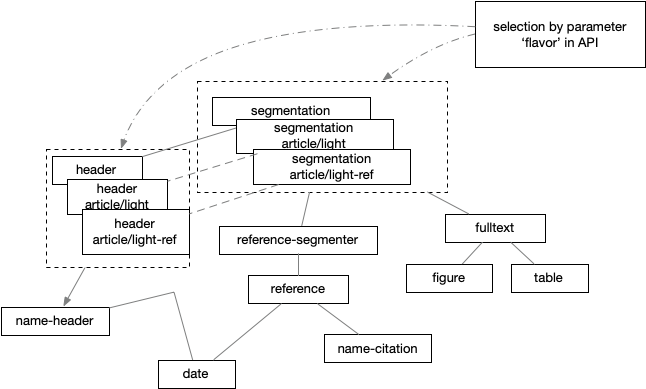
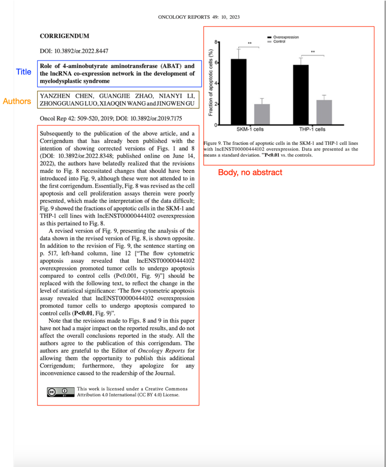

# GROBID specialised processing (aka flavors)

## Introduction

This is a simple management of alternative models to use when processing a document. 
A model variant (or flavor) is for example an alternative header model trained with its own training data and labels (to cover documents with specific header section different from scholar articles), or an alternative segmentation model for segmenting something else than scholar papers.

To process a document with alternative model(s), we use a string called "flavor" to identify it. 
If the flavor is indicated, the selected model will use the "flavor" model if it exists, and the normal model if the flavor does exist for this model (so defaulting back then to the standard models).

Flavor model training data are always located as subdirectories of the standard training data path, e.g. for the flavor "sdo/ietf", the training data of the header model for this flavor will be under `grobid-trainer/resources/dataset/header/article/light-ref`. 
The training data of the segmentation model for this flavor will be under `grobid-trainer/resources/dataset/segmentation/article/light`, and so on.

For running grobid following a particular flavor, we add the flavor name as additional parameter of the service.

Example for processing a SDO/IETF document: 
```shell
curl -v --form input=@./XP123456.pdf --form "flavor=sdo/ietf" localhost:8070/api/processFulltextDocument
```

Example for processing a scientific article using a lightweight model: 
```shell
curl -v --form input=@./nihms834197.pdf --form "flavor=article/light-ref" localhost:8070/api/processFulltextDocument
```

Following, an updated view of the cascade architecture:



## Flavors

At the moment, the flavored processes are available as follows:

| Name                                                      | Identifier            | Flavored models                        | Description                                                                                                                                                                                                                 | Advantages                                                                                                                                                                                                                                     | Limitations                                                                                                                                                           |
|-----------------------------------------------------------|-----------------------|----------------------------------------|-----------------------------------------------------------------------------------------------------------------------------------------------------------------------------------------------------------------------------|------------------------------------------------------------------------------------------------------------------------------------------------------------------------------------------------------------------------------------------------|-----------------------------------------------------------------------------------------------------------------------------------------------------------------------|
| Article lightweight structure                             | `article/light`       | `segmentation`, `header`, `fulltext`   | Simplified process for flavors of scientific articles that extracts title, authors, publication date and DOI from the header, everything else is considered as the fulltext body which is further segmented into paragraphs | Simple model that can work with any document and bring the advantage of pdfalto processing which solves many issue with text ordering and column recognition.                                                                                  | All noise not being part of the article, such as references, page numbers, head notes, and footnotes are also included in the body. No tables or figures recognition. |
| Article lightweight structure with references             | `article/light-ref`   | `segmentation`, `header`, `fulltext`   | Same as the `article/light` with the the reference citations                                                                                                                                                                | Variation of the `article/light` that includes the recognition of references. More versatile than `article/light` in the realm of variation of scientific articles, such as corrections, erratums, letters which may contain references.       |                                                                                                                                                                       |
| Internet Engineering Task Force (IETF) Standard Documents | `sdo/ietf`            | `segmentation`, `header`               | Processing of the IETF Standard documentation                                                                                                                                                                               | Supports the procesisng of a different flavor of documents                                                                                                                                                                                     |                                                                                                                                                                       |

### Standard specification documents (IETF, 3GPP)

The SDO IETF (Internet Engineering Task Force) and 3GPP (3rd Generation Partnership Project) are influential standardization bodies that create technical specifications for the telecommunications and networking industries. 
These standards describe protocols, architecture, security frameworks, and service models for modern networks, including 5G, IP networking, and related technologies.
Unlike general scientific papers, which might feature more fluid content and citation formats, IETF and 3GPP documents adhere to a strict template, often including fields such as RFC (Request for Comments) numbers, version identifiers, sections for protocol details, and test specifications. 


### Article lightweight structure (`article/light`), and with references (`article/light-ref`)

In large harvesting pipelines for scientific content, is common to have documents that are related to scientific articles, such as corrections, letters to editors, editorials, etc that are not well processed by a the standard grobid processing because the structure is different. 
Most common difference is the absence of abstract and references. Some may just have a title and body. 
Those kind of document still represent a relevant part of the scientific communication.  



_Article lightweight_ specialised processes are a simplified version of the standard processing for scientific articles, which extract only a subset of information.
The simplistic approach pose no limitation to what type of document can be processed in case of needs of a simple process. 

The header information are reduced to title, authors, publication date and DOI: 
The body is not formatted as a structured text, but as a single paragraph.

```xml
<body>
    <div
        xmlns="http://www.tei-c.org/ns/1.0">
        <p>ONCOLOGY REPORTS 49: 10, 2023 CORRIGENDUM</p>
        <p>Oncol Rep 42: 509-520, 2019; DOI: 10.3892/or.2019.7175 Subsequently to the publication of the above article, and a Corrigendum that has already been published with the intention of showing corrected versions of Figs. 1 and 8 (DOI: 10.3892/or.2022.8348; published online on June 14, 2022), the authors have belatedly realized that the revisions made to Fig. 8 necessitated changes that should have been introduced into Fig. 9, although these were not attended to in the first corrigendum. Essentially, Fig. 8 was revised as the cell apoptosis and cell proliferation assays therein were poorly presented, which made the interpretation of the data difficult; Fig. 9 showed the fractions of apoptotic cells in the SKM-1 and THP-1 cell lines with lncENST00000444102 overexpression as this pertained to Fig. 8. A revised version of Fig. 9, presenting the analysis of the data shown in the revised version of Fig. 8, is shown opposite. In addition to the revision of Fig. 9, the sentence starting on p. 517, left-hand column, line 12 ["The flow cytometric apoptosis assay revealed that lncENST00000444102 overexpression promoted tumor cells to undergo apoptosis compared to control cells (P&lt;0.001, Fig. 9)"] should be replaced with the following text, to reflect the change in the level of statistical significance: 'The flow cytometric apoptosis assay revealed that lncENST00000444102 overexpression promoted tumor cells to undergo apoptosis compared to control cells (P&lt;0.01, Fig. 9)". Note that the revisions made to Figs. 8 and 9 in this paper have not had a major impact on the reported results, and do not affect the overall conclusions reported in the study. All the authors agree to the publication of this corrigendum. The authors are grateful to the Editor of Oncology Reports for allowing them the opportunity to publish this additional Corrigendum; furthermore, they apologize for any inconvenience caused to the readership of the Journal. Figure 9. The fraction of apoptotic cells in the SKM-1 and THP-1 cell lines with lncENST00000444102 overexpression. Data are presented as the means ± standard deviation. ** P&lt;0.01 vs. the controls. This work is licensed under a Creative Commons Attribution 4.0 International (CC BY 4.0) License.</p>
    </div>
</body>
```

## Training the specialised flavor models  

The training data for the flavors modes `article/light` and `article/light-ref` are following the same structure as the standard models. 
In other words the annotated training data for, e.g., the lightweight segmentation model with references, for articles, are following the guidelines as the standard grobid segmentation model. 
The Grobid parser select automatically the right subset of labels to include. 
However, this can be implemented at discretion of the user, so for example a flavor `sdo/ietf` for parsing standards documents for IETF, can be following their specific guidelines.

For training the specialised models the same procedure as for the standard models is used, but the flavor is indicated in the training command, e.g. to train the segmentation model for the flavor `article/light`: 

```shell
./gradlew train_segmentation_article_light
```

or the header model for the flavor `article/light-ref`: 

```shell
./gradlew train_header_article_light_ref
```

## Benchmarking

The evaluation of the flavors is performed in the same way as the standard processing for scientific articles:

- **BidLSTM_ChainCRF_FEATURES** as sequence labeling for the header model

- **BidLSTM_ChainCRF_FEATURES** as sequence labeling for the reference-segmenter model

- **BidLSTM-CRF-FEATURES** as sequence labeling for the citation model

- **BidLSTM_CRF_FEATURES** as sequence labeling for the affiliation-address model

- **CRF Wapiti** as sequence labelling engine for all other models.

Header extractions are consolidated by default with [biblio-glutton](https://github.com/kermitt2/biblio-glutton) service (the results with CrossRef REST API as consolidation service should be similar but much slower).

The evaluation, which is usually create grobid files suffixing `fulltext.tei.xml`, will suffix also the flavor, for example `article/light` will be suffixed as `article_light.tei.xml`.
In this way is possible to run evaluation for multiple flavor without loosing the Grobid processed files.

The evaluation is performed on a reduced set of fields:

| Flavor              | Header fields                      | Fulltext fields | Citation fields                  | 
|---------------------|------------------------------------|-----------------|----------------------------------|
| `article/light`     | `title`, `first author`, `authors` | N/A             | N/A                              |
| `article/light-ref` | `title`, `first author`, `authors` | N/A             | Same as the standard processing* |

(*) for this flavor the citation model is included to avoid regressions, as the citation parsing is performed using the standard citation model

The benchmarks results are listed here with links to the full reports.

### Article lightweight structure

| Corpus          | Header avg. f1* | Full report                                                                       | 
|-----------------|-----------------|-----------------------------------------------------------------------------------|
| Bioxiv          | 89.4            | [benchmaking-biorxiv.md](benchmarks/flavors/article_light/benchmaking-biorxiv.md) |
| PMC_sample_1943 | 95.71           | [benchmaking-pmc.md](benchmarks/flavors/article_light/benchmaking-pmc.md)         |
| PLOS_1000       | 99.37           | [benchmaking-plos.md](benchmarks/flavors/article_light/benchmaking-plos.md)       |
| eLife_984       | 88.73           | [benchmaking-elife.md](benchmarks/flavors/article_light/benchmaking-elife.md)     |

### Article lightweight structure with references

| Corpus          | Header avg. f1* | Citations avg. f1+ | Full report                                                                           | 
|-----------------|-----------------|--------------------|---------------------------------------------------------------------------------------|
| Bioxiv          | 89.79           | 56.31              | [benchmaking-biorxiv.md](benchmarks/flavors/article_light_ref/benchmaking-biorxiv.md) |
| PMC_sample_1943 | 95.74           | 58.78              | [benchmaking-pmc.md](benchmarks/flavors/article_light_ref/benchmaking-pmc.md)         |
| PLOS_1000       | 99.52           | 48.04              | [benchmaking-plos.md](benchmarks/flavors/article_light_ref/benchmaking-plos.md)       |
| eLife_984       | 91.35           | 76.14              | [benchmaking-elife.md](benchmarks/flavors/article_light_ref/benchmaking-elife.md)     |

(*) avg. micro F1 Ratcliff/Obershelp@0.95

(+) Instance-level f-score (RatcliffObershelp)
