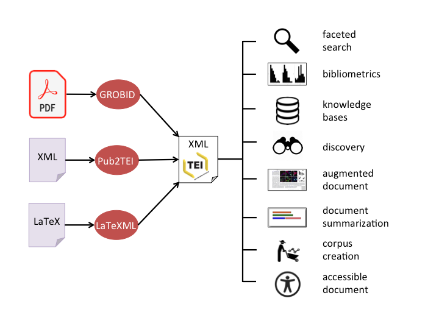
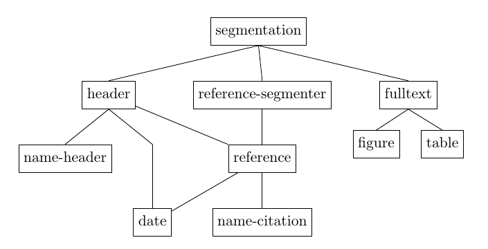
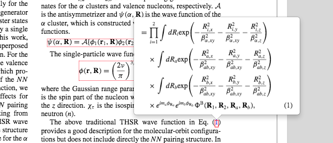

<h1>How GROBID works</h1>

GROBID is a machine learning library for extracting, parsing, and re-structuring raw documents, in particular PDF, into structured XML/TEI encoded documents and focusing on technical and scientific publications. The goal of GROBID is to facilitate text mining, information extraction, and semantic analysis of scientific publications by transforming them into machine-friendly, structured, and predictable representations. 

In large scale scientific document ingestion tasks, the large majority of documents are only available in PDF (in particular decades of backfiles before the year 2000). Scholar articles are today more frequently available as XML, but often require particular agreements and long negotiations with publishers. PDF remains today the most important format usable under fair-use or under the recent copyrights exception for text mining in the EU. When publisher XML are available, they remain challenging to process because they are encoded in a variety of different native publisher XML formats, often incomplete and inconsistent from one to another, difficult to use at scale.

<b>Fig. 1</b> - Ingesting scientific documents with GROBID

To process publisher XML, complementary to GROBID, we built [Pub2TEI](https://github.com/kermitt2/Pub2TEI), a collection of style sheets developed over 11 years able to transform a variety of publisher XML format to the same TEI XML format as produced by GROBID. This common format, which supersedes a dozen of publisher formats and many of their flavors, can centralize further any processing across PDF and heterogeneous XML sources, and support various applications (see __Fig. 1__). 

The rest of this page gives an overview of the main GROBID design principles. Skip it if you are not interested in the technical details. Functionalities are described in the [User Manual](https://grobid.readthedocs.io/en/latest/). Recent benchmarking are available [here](https://grobid.readthedocs.io/en/latest/Benchmarking/).

## Document parsing as a cascade of sequence labeling models

GROBID uses a cascade of sequence labeling models to parse a document. This modular approach makes possible to adapt the training data, the features, the text representations, and the models to the different hierarchical structures of the document. Each individual model maintains a small amount of labels (which is easier to manage and train), but, in combination, the full cascade provides very detailed end-result structures. The final models produce 55 different "leaf" labels, while other document analysis layout systems support significantly less label categories (up to 22 for GROTOAP2 dataset and CERMINE, _Tkaczyk et al., 2014_, the highest to our knowledge after GROBID).

In GROBID, sequence labeling is defined in an abstract manner and its concrete implementation can be selected among different standard ML architectures, including a fast linear chain CRF and a variety of state-of-the-art Deep Learning (DL) models. Sequence labeling models are limited to the labeling of a linear sequence of tokens, therefore they associate a one-dimension structure to a stream of tokens. One way to create additional nested structures is to cascade several sequence labeling models, the output of a first model being piped to one or several models. This is the approach taken by GROBID.

__Fig. 2__ shows the current model cascade. Each model typically uses its own combination of sequence labeling algorithm, features, and possibly a different tokenizer. The model architecture and parameters depend on the labels to be used, on the amount of available training data, on the runtime, memory and accuracy constraints, etc. This approach finally helps to mitigate class imbalanced problems, for instance a majority class like "paragraph" will not impact a rare class from a non-body area (e.g. a field appearing only one time in a header) by keeping the imbalanced classes in separated models. 

<b>Fig. 2</b> - The GROBID cascade of sequence labeling models

The _segmentation model_ for instance is used to detect the main areas of a document, e.g. the title page, the header, the body, the headnotes and footnotes, the bibliographical sections, etc. This particular model works by labeling each line and heavily rely on layout features. Working at line level is significantly faster than a token-level model, which is good for a model applied to the entire content of the document. The areas introduced by this model correspond to large zones, which are never interrupting a line. 

The header areas detected by the segmentation model (which could include several non-continuous areas distributed in several pages) are passed to the _header model_. The header model is trained to recognized information like title, authors, affiliation, abstract, etc. This model works at layout token level. As it processes a smaller amount of text, working at token-level is less impactful regarding runtime, and the model can use a larger amount of training examples. 

Some models can be used at several locations in the document. For instance the _date model_, used to segment a raw date into years, months, etc. and to provide a normalized ISO date, is called when dates are identified not only in the header area, but also when parsing a reference zone. Similarly, the figure or table models are applied to sub-structure every figures and tables of a document. A GROBID model is thus context-free. 

The structuring of the same entity type, however, can depend on the position of this entity. For instance, author names in the header and author names in a reference string are expressed in a different manner. Author names in the header usually use full names and are associated with affiliation markers. Author names in reference string are usually much shorter and never mixed with affiliation information. For this reason, we introduced two different models for name parsing, a `name_header` model and a `name_citation` model. 

Cascading models offers thus the flexibility to tune each model and associated simpler training data to the nature of the structure to be recognized. In addition, it maintains each model small, while producing in combination to very fine-grained final structures. Finally, although errors from a model can be propagated to another model, we train each model with a certain amount of realistic errors and noise as input (which is anyway more or less always happening with PDF), which makes possible to recover upstream model errors. 

## Layout tokens, not text

The different GROBID models do not work on text, but on **Layout Tokens** to exploit various visual/layout information available for every token. Layout information provide at the same time more criteria of decision for the recognition of structures and more robustness to layout variations. 

GROBID Layout Token is a structure containing the Unicode text token but also the associated available rich text information (font size and name, style attributes - bold, italic, superscript/subscript) and the location in the PDF expressed by bounding boxes. Layout Tokens are grouped following visual criteria (lines, blocks, columns) as a first result of the PDF layout analysis, and then further semantically grouped through the Machine Learning process, following the labeled fields. In addition, these layout information are used to create additional layout features like indentation, relative spacing indicators, relative page vertical and horizontal positions, character density or bitmap/vector graphics relative position information. In most GROBID models, these layout features are set at every layout token. 

The layout information are extracted and built by [pdfalto](https://github.com/kermitt2/pdfalto), a PDF parser that provides line, block and various position and style information to GROBID. Complementary to the support of ALTO, a modern format for OCR output, pdfalto handles a variety of cleaning processes: UTF-8 encoding and character composition, the recognition of superscript/subscript style and the robust recognition of line numbers for review manuscripts, the recovery of text order at block level, the detection of columns, etc. The detection of token boundaries, lines and block information are using XY projection and heuristics. pdfalto also extracts embedded bitmap (all converted into PNG) and vector graphics (in SVG), PDF metadata (XMP) and PDF annotations for further usage in GROBID. 

Layout information are used to instantiate layout features, which can be exploited or not depending on the capacity of the ML model implementation. Layout features are useful for the reliable recognition of structures such as titles, abstracts, section titles, figures, tables, or reference markers, which are often mostly characterized by their relative position (vertical space, indentation, blocks, etc.) and font style (e.g. superscript for reference markers or title in larger font). 

Dedicated joint Deep Learning models able to exploit these additional layout features have been developed in [DeLFT](https://github.com/kermitt2/delft) to complement CRF models. 

<b>Fig. 3</b> - Visualization of a cited figure in context

GROBID models maintain a synchronization between the labeling process and the layout token bounding boxes. It means that as the labeled fields are built via sequence labeling, the bounding boxes of the created structures are also build. Operations on 2D bounding boxes are well known and straight-forward to apply to Layout elements. By synchronizing the bounding boxes with the sequence labeling, we can render any structured results on their original PDF source. More generally, applied to any PDF processing, extracted structures and annotations can include bounding boxes giving precise location in the original document layout. Text mining is then not limited to populating a database, it allows user-friendly visualizations of semantically enriched documents and new user interactions. __Fig. 3 and 4__ presents two examples of visualization of extracted objects thanks to GROBID coordinates associated to structures. 

<b>Fig. 4</b> - Visualization of a cited equation in context

## Training data: _Qualität statt Quantität_

GROBID does not use a vast amount of training data derived from existing publisher XML documents, like CERMINE _(Tkaczyk et al., 2015)_ or ScienceParse 1 &amp; 2, but small, high quality sets of manually-labeled training data. The data to be labeled are directly generated from PDF (not from publisher XML) and continuously extended with error cases. Although we also experimented with the large-set approaches and auto-generated training data at scale, we still currently remain with the quality over quantity approach, the reasons being the following ones: 

- Exploiting publisher XML suppose to be able to align the clean XML content with the noisy PDF content. This is complicated to realize in practice at full document scale, because publisher fulltext XML do not follow the actual PDF object stream, some XML elements are encoded very differently from what can be extracted from the PDF (e.g. equations, chemical formula, tables, section titles, references, ...), present only in XML (sometimes keywords in PMC JATS are not in the PDF) or present only in the PDF (cover page, copyrights/editorial statements, head notes). In addition, some spurious template presentation tokens in the PDF are normally absent from the XML because considered as presentation sugar or noise - what they are, they do not carry any useful semantic information. These PDF scoria are however very useful to help the recognition of structures as they can indicate field boundaries. A super large dataset from publisher XML/PDF tends to be closer to the XML than the actual PDF content, because either (i) only PDF very close to the corresponding XML are successfully aligned and kept or (ii) only "easy" document layout segments/pages are kept.

- With a large amount of training data, the addition of a few new examples has no generalization impact, because the new examples are diluted in the vast amount of training. It is then, in practice, impossible to further improve the model with additional training data and to recover errors. On the other hand, with a small training dataset, the addition of a few error cases can correct the model and it is possible to quickly iterate and improve the model continuously in an active learning manner. 

- Using available publisher XML, it is difficult to build a large set of training data presenting a good diversity in domains and layouts. Beyond PMC and preprints, other kinds of publications would be needed, but they are complicated to harvest at similar scale due to copyright reasons and the mosaic of publishers. In contrast, by building our small training set iteratively with error cases, we introduce documents preferably from domains and publishers weakly represented in the current training dataset and maintain a stronger diversity.

- High-quality training data usually balance well a small training size. Quality training data generally improve the learning rate because inconsistent annotations increase artificial aleatoric uncertainty in the model (note: reference needed).

- A lower amount of training data can keep models smaller (e.g. with CRF), faster to train and thus easier for setting hyperparameters.

In practice, the size of GROBID training data is smaller than the ones of CERMINE _(Tkaczyk et al., 2015)_ by a factor 30 to 100, and smaller than ScienceParse 2 by a factor 2500 to 10000. Still GROBID provides comparable or better accuracy scores. To help to ensure high-quality training data, we develop detailed [annotation guidelines](training/General-principles/) to remove as much as possible disagreements/inconsistencies regarding the annotation decision. The training data is reviewed regularly. We do not use double-blind annotation with reconciliation and do not compute Inter Annotator Agreement (as we should), because the average size of the annotation team is under 2 :)

## Evaluation

As the training data is crafted for accuracy and coverage, training data is strongly biased by undersampling non-edge cases. Or to rephrase it maybe more clearly: the less "informative" training examples, which are the most common ones, are less represented in our training data. Because of this bias, our manually labeled data cannot be used for evaluation. Evaluations of GROBID models are thus done with separated and stable holdout sets from publishers, which follow more realistic distributions of document variations. 

See the current evaluations with [PubMed Central holdout set](https://grobid.readthedocs.io/en/latest/Benchmarking-pmc/) (1,943 documents, 90,125 bibliographical references in 139,835 citation contexts) and [bioarXiv holdout set](https://grobid.readthedocs.io/en/latest/Benchmarking-biorxiv/) (2,000 documents, 98,753 bibliographical references in 142,796 citation contexts). 

Our evaluation approach, however, raises two main issues: 

- our publisher evaluation sets present currently the same lack of diversity drawback as discussed above with publisher XML-based training data, because the evaluation sets are all coming from life science or preprints. However, as compared to most of the similar works, we do not train and evaluate at the same time with the same domains and sources of publications, because we maintain a strong diversity in the training data. 

- although much better adapted to tackle the gap between the n-fold validation and real performance, the usage of stable holdout sets (usually favored by ML practitioners) can lead to lower reliability over time due to successive re-uses of the holdout data for guiding design improvements (as we validate addition of training data and features based on holdout set performance). 

For addressing these two issues, we plan to regularly add new holdout sets from various sources over time, trying to exploit new XML publications available under appropriate license. 

## Transformer approaches incorporating layout information

For the moment, we are also not relying on transformer approaches incorporating layout information, like LayoutML _(Xu et al., 2020)_, LayoutLMv2 _(Xu et al., 2021)_, SelfDoc or VILA _(Shen et al., 2021)_, which require considerable GPU capacities, long inference runtime, and do not show at this time convincing accuracy scores as compared to the current GROBID cheap approach (reported accuracy at token level are often lower than GROBID accuracy at field level, while using less labels). 

However, these approaches are very promising. In GROBID, it is possible to run BERT and SciBERT baseline fine-tuned models, ignoring available layout features. We think the system is thus more or less ready to experiment with fine-tuning such extended transformer models - or rather few-shot learning given the size of our annotated example set - when/if they can surpass some of the current models (and when we will have saved enough money to buy a V100 GPU). 

## Balancing accuracy and scalability

We develop a tool to process the full scholar literature corpus (several ten million PDF documents), but also to allow interactive usage, e.g. processing the header of a PDF article in sub-second. It's why the default configuration of GROBID is still set to CRF to maintain the ability to process PDF quickly, with commodity hardware, with low memory usage to ensure good parallelization and scalability capacities.

However, if the priority is accuracy, we also make possible custom settings to maximize the accuracy with deep learning models. Using some deep learning models will improve results by a few additional F1-score points (nothing extraordinary to be honest), but at the price of a slower runtime (2 to 5 times slower), the price of a GPU and more limited parallelization. 

## References

_(Tkaczyk et al., 2014)_ Dominika  Tkaczyk,  Pawel  Szostek,  and  Lukasz  Bolikowski. 2014.  Grotoap2 - the methodology of creating a large ground truth dataset of scientific articles. D-Lib Magazine, 20(11/12)

_(Tkaczyk et al., 2015)_ Dominika  Tkaczyk,  Paweł  Szostek,  Mateusz  Fedoryszak,  Piotr  Jan  Dendek,  and  Łukasz  Bolikowski. 2015. Cermine: automatic extraction of structured metadata from scientific literature. International Journal on Document Analysis and Recognition (IJDAR), 18(4):317-335

[Science Parse](https://github.com/allenai/science-parse), https://github.com/allenai/science-parse

[Science Parse v2](https://github.com/allenai/spv2), https://github.com/allenai/spv2

_(Shen et al., 2021)_ Zejiang Shen, Kyle Lo, Lucy Lu Wang, Bailey Kuehl, Daniel S. Weld, Doug Downey. 2021. [Incorporating Visual Layout Structures for Scientific Text Classification](https://arxiv.org/pdf/2106.00676.pdf). arXiv:2106.00676

_(Xu et al., 2020)_ Yiheng Xu, Minghao Li, Lei Cui, Shaohan Huang, Furu Wei, Ming Zhou. [LayoutLM: Pre-training of Text and Layout for Document Image Understanding](https://arxiv.org/pdf/1912.13318.pdf). KDD 2020

_(Xu et al., 2021)_ Yang Xu, Yiheng Xu, Tengchao Lv, Lei Cui, Furu Wei, Guoxin Wang, Yijuan Lu, Dinei Florencio, Cha Zhang, Wanxiang Che, Min Zhang, Lidong Zhou. 2021. [LayoutLMv2: Multi-modal Pre-training for Visually-Rich Document Understanding](https://arxiv.org/pdf/2012.14740.pdf). arXiv:2012.14740 
