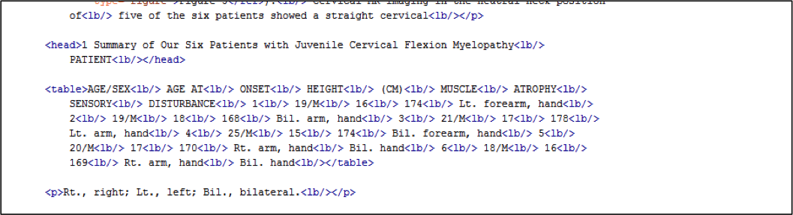
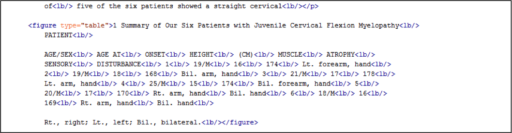

# Annotation guidelines for the 'fulltext' model

## Introduction

As mentioned elsewhere (TODO:link), there are several models that are used to analyze the contents of a PDF file. One of them is the 'fulltext' model which attempts to recognize and struture items appearing in the body text of an article or a publication.  This is different from for example the 'segmentation' model which tries to recognize the general sections (title page, front, body, bibliography).

> Note: Whitespace is not important in the XML that Grobid uses. You can add newline characters and spaces to make the XML document more legible.

The 'Fulltext' model attempts to recognize the following objects:

* paragraphs
* titles (of sections, not the actual article or publication)
* figures
* tables (which, for Grobid, are actual special figures)
* formulas
* list items inside lists
* callouts to figures ('see Fig. 1'), to tables, to formulas amd to bibliographical references ('Austin 2008(b)'), etc.

The following sections will give examples for each of the objects above and how they should be marked up.

## Analysis

### Section titles

To indicate sub parts of an article, authors may have used section titles that subdivide the flow of the content into smaller chunks. These titles should appear on the same level as the Paragraphs, formulas, etc.  Here are some examples:

```xml
<head>CERAMIDE AND S1P BOTH TRIGGER AUTOPHAGY<lb/></head>
```

```xml
<head>1. Introduction<lb/></head>
<head>2 Background<lb/></head>
```

```xml
<head>B. Focusing an IACT<lb/></head>
```

```xml
<head>II. PROBLEM AND SOLUTION PROCEDURE<lb/></head>
```

```xml
<head>4 RESULTS<lb/></head>
<head>4.1 Image quality<lb/></head>
```

```xml
<head>Results<lb/></head>
<head>Patient characteristics<lb/></head>
```

```xml
<head>MATERIALS AND METHODS<lb/></head>
<head>Tissue samples<lb/></head>
```

### Paragraphs

Paragraphs constitute the main bulk of most typical articles or publications and contain text which in turn may contain inline elements such as references (see below) or line breaks.

```xml
<p>Our group has investigated the correlation between sphingolipid metabolism, the
  <lb/>
  …
  <lb/> are able to induce autophagy in a breast cancer cell line. 3,4
  <lb/>
</p>
```

> Note: The `lb` (line break) elements are there because they have been recognized as such, but they don't have any impact on the structuring algorithm.

The following example is interesting because it demonstrates that formulas should be on the same hierarchical level as paragraphs, and not be contained inside paragraphs.

```xml
<p>Exponentiation mixes. Our protocol will benefit from the exponentiation mix
  <lb/>
	…
  <lb/> MS i+1 . The first server takes the original list of PKs. The net
	effect is a list:
  <lb/>
</p>

<formula>(g x ρ(i) ·s ) i∈[n] ,<lb/>
		</formula>

<p>where:<lb/></p>

<formula>π =
  <lb/> [n]
  <lb/> 1
  <lb/> ρ i , s =
  <lb/> [n]
  <lb/> 1
  <lb/> s i ,
  <lb/>
</formula>

<p>and g s is also published by the last Teller.
  <lb/>
  …
  <lb/> (g s ) xi and finding the
match.
  <lb/>
</p>
```

The next example shows, again, that list items should contained inside `list` elements which in turn are on the same hierarchical level as paragraphs and other block-level elements.

```xml
<p>The estimation of the eligible own funds and the SCR requires to carry out
	calculations
  <lb/>
  …
  <lb/> the following constraints:
  <lb/>
</p>

<list>
  <item>• updating the assets and liabilities model points;
    <lb/>
  </item>

  <item>• constructing a set of economic scenarios under the risk-neutral probability and
    <lb/>
	  checking its market-consistency;
    <lb/>
  </item>
</list>

<p>The wild-type strain was Bristol N2. All animals were raised at
  <lb/> 20uC. The following
	alleles and transgenes were used:
  <lb/>
</p>

<p>LGI: hda-3(ok1991)
  <lb/>
</p>

<p>LGII: hda-2(ok1479)
  <lb/>
</p>

<p>LGIII: saeg-2(hj9), saeg-2(ok3174)
  <lb/>
</p>

<p>LGIV: egl-4(n479), egl-4(mg410), egl-4(mg410hj32), egl-4(mg410hj40),
  <lb/>
	egl-4(mg410hj33)
  <lb/>
</p>
```

### Figures and tables

A photo, picture or other graphical representation (this could be a chart or another figure) are to be marked up using the `figure` element. This element surrounds the title, the figure itself, any legend or notes it may have.

As mentioned above, a table, in the context of Grobid, is considered to be a figure of type "table".

The following code sample shows one figure in the literal sense followed by two tables. Note that they are marked up as `figure type="table"` elements.

```xml
<figure>Figure 1. Hypothetical model for ceramide and S1P-induced autophagy and thei	consequences on cell fate. An
  <lb/>
  …
  <lb/>
  …
  <lb/> promotes cell survival by inhibiting the induction of apoptosis.
</figure>

<figure type="table"> Table 1 Clades of clownfishes used in this study
  <lb/> Clade name
  <lb/>
	Species
  <lb/> percula
  <lb/> A. ocellaris, A. percula, P. biaculeatus
  <lb/> Australian
  <lb/>
	A. akindynos, A. mccullochi
  <lb/> …
  <lb/> of clownfish species [19].
  <lb/>
</figure>

<figure type="table"> Table 1 The clinicopathological data of PDAC tissue samples
  <lb/>Sample
  <lb/> Age
  <lb/> Sex
  <lb/> Location a
  <lb/> Histology b
  <lb/> T
  <lb/> N
  <lb/> M
  <lb/>Stage
  <lb/>…
  <lb/> poor
  <lb/> 4
  <lb/> 1
  <lb/> 1
  <lb/> IVb
  <lb/> a
  <lb/> P ¼ primary
	lesion; Ph ¼ head; Pb ¼ body; Pt ¼ tail of the pancreas; LM ¼ liver metastatic lesion. b
	mod ¼ moderately; poor ¼ poorly differentiated tubular adenocarcinoma.
  <lb/> PDAC ¼
	pancreatic ductal adenocarcinoma; FISH ¼ fluorescence in situ hybridisation; ISH ¼ in
	situ RNA hybridisation.
  <lb/>
</figure>
```

Finally, an example where Grobid has recognized a table but used the `table` element to mark it up; this needs to be corrected to `figure type="table"`.


The XML as suggested by Grobid before the training (note the `table` element):



The corrected XML (note the `figure type="table"` element):



### Formulas

```xml
<formula>σ α β =
  <lb/> 1
  <lb/> 3<
  lb/> ˙
  <lb/> R
  <lb/> R −
  <lb/> ˙
  <lb/> R
  <lb/> R
  <lb/> diag(0, 2,
	−1, −1),
  <lb/>
	<label>(10)</label>
  <lb/>
</formula>
```

### List items

As one would expect, list items (`item` elements) should be contained in a `list` element and must not occur within `p` elements. At this stage no difference is made between ordered and unordered lists.

List item markers such as hyphens, bullet points (for unordered lists) or numbers and letters (for ordered lists) should be contained within the `item` element.

```xml
<p>Introducing ballot identifiers has the appeal that it provides voters with a
  <lb/> very
	simple, direct and easy to understand way to confirm that their vote is
  <lb/> …
  <lb/> this observation
	that we exploit to counter this threat: we arrange for the voters
  <lb/> to learn their
	tracker numbers only after the information has been posted to the
  <lb/> WBB.
  <lb/> This
	paper presents a scheme that addresses both of these shortcomings by:
  <lb/>
</p>

<list>
  <item>– Guaranteeing that voters get unique trackers.
    <lb/>
  </item>

  <item>– Arranging for voters to learn their tracker only after the votes and corre-
    <lb/>sponding tracking numbers have been posted (in the clear).
    <lb/>
  </item>
</list>

<list>
	<item>1) The difficulty of identifying passages in a user&apos;s manual based on an individual word.
    <lb/>
  </item>

  <item>2) The difficulty of distinguishing affirmative and negative sentences which mean	two different
    <lb/> features in the manual.
    <lb/>
  </item>

  <item>3) The difficulty of retrieving appropriate passages for a query using words not appearing in the
    <lb/> manual.
    <lb/>
  </item>
</list>
```

### Callouts and references

These elements appear as inline elements, inside `p`, `item`, or other elements containing and usual reference other parts of the document. They could be understood as links.  Here is a list of potential references:

* `ref type="biblio"` a link to a bibliographical reference (of the type *see **Austin 1982/b** * )
* `ref type="figure"` a pointer to a figure elsewhere in the document (*Fig 5b, left*)
*  `ref type="table"` a link to a table in the document
* `ref type="box"` a link to some boxed content (a box with additional content, outside the flow of the general content)
* `ref type="formula"` a link to a formula

#### Bibliographical references

The following example shows two bibliographical references:

```xml
<p>The clinical entity of cervical flexion myelopa-
  <lb/>thy proposed in the 1960s by Reid

  <ref type="biblio">[16,17]</ref> and

  <lb/> Breig et al

  <ref type="biblio">[2,3]</ref>

  has been neglected for a long time.
  <lb/>…
  <lb/> …
  <lb/> groups of males and females controls.
  <lb/>
</p>
```

To highlight the diversity of bibliographical references, here are some more examples:

```xml
by <ref type="biblio">Greve et al. [1994]</ref> and <ref type="biblio">Koch et al.<lb/> [1994]</ref>
```

```xml
<ref type="biblio">[Whitham, 1954; Hogg and Pritchard,<lb/> 2004]</ref>
```

```xml
<ref type="biblio">[Abramowitz and Stegun,<lb/> 1964, see pp. 559 – 562] </ref>
```

```xml
<ref type="biblio">LEWANDOWSKI (1982b)</ref> has reported
```

```xml
<ref type="biblio">(STANCZYKOWSKA, 1977)</ref>
```

```xml
(e.g., <ref type="biblio">Bryant<lb/> &amp; Goswami, 1987</ref>)
by<lb/> <ref type="biblio">Smith and Matsoukas [1998]</ref> and <ref type="biblio">Khelifa and Hill [2006b]<lb/></ref>
```

```xml
by <ref type="biblio">Gal [1979]</ref> and<lb/> illustrated further recently by <ref type="biblio">Draper and Lund [2004]</ref>
```

```xml
Harbaugh and Harbaugh <ref type="biblio">[7]</ref>
```

```xml
in Lolle et al. <ref type="biblio">1</ref>
```

```xml
This was established in<lb/> <ref type="biblio">Thompson v. Lochert (1997)</ref> <ref type="biblio">[114]</ref> in which
```

```xml
<ref type="biblio">(ref. 1)</ref>
```

```xml
such as receptors for IL-1β <ref type="biblio">(REFS 64,65)</ref>,<lb/> TNF <ref type="biblio">66</ref> and IFNγ <ref type="biblio">67</ref> .
```

#### References to tables and figures

The next example shows references to a table and a figure (as noted earlier, whitespace is not of importance for Grobid and can therefore be used liberally, like here to better show the references):

```xml
<p>The patient group comprised all six patients with
  <lb/> juvenile cervical
	flexion myelopathy admitted to
  <lb/> our hospital

  <ref type="table"> (Table 1) </ref>.

  In all of them, cervical flexion
  <lb/> …
  <lb/>alignment in the extended neck position

  <ref
	type="figure"> (Figure 3) </ref>.

  <lb/> Cervical MR imaging in the neutral neck position
	of
  <lb/> five of the six patients showed a straight cervical
  <lb/>
</p>
```

Finally, an example of a reference to two formulas (and a bibliographical entry):

```xml
<p>Here, Θ(y) denotes …
  <lb/> …
  <lb/> the semi-cylindrical drum. The dynamics of the avalanches of eqs.

  <ref type="formula">(1)</ref>

  and

  <ref type="formula">(2)</ref>

  is centered
  <lb/> around the angle ϕ d = tan b 0

  <ref type="biblio">[7]</ref>. …

  <lb/> … stochastic extension of the DMM:
  <lb/>
</p>
```

Here are some more short examples for figure references:

```xml
<ref type="figure">(Supplementary Fig. 1<lb/> online)</ref>
```

```xml
<ref type="figure">(Fig. 5b, left)</ref>
```

```xml
<ref type="figure">Figure 2</ref> exemplifies
```

```xml
In <ref type="figure">figs. 3 and 4</ref>
```

```xml
(10.3% of those analysed; <ref type="figure">Fig. 1a</ref>).
```
