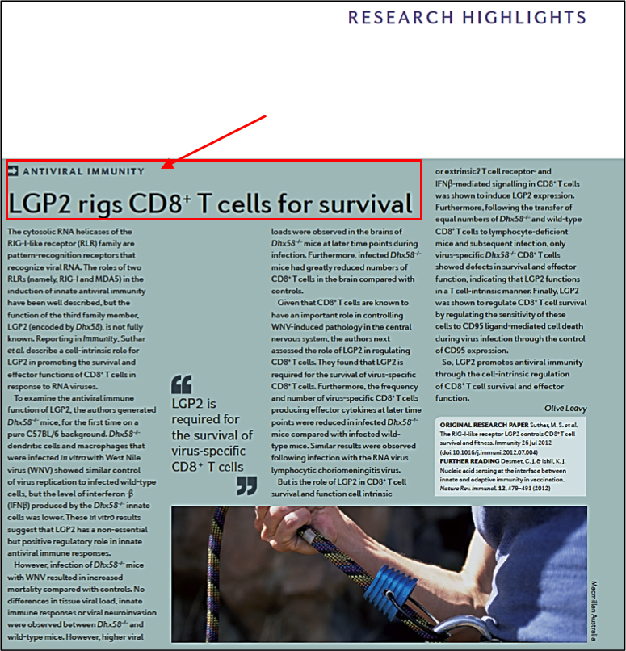
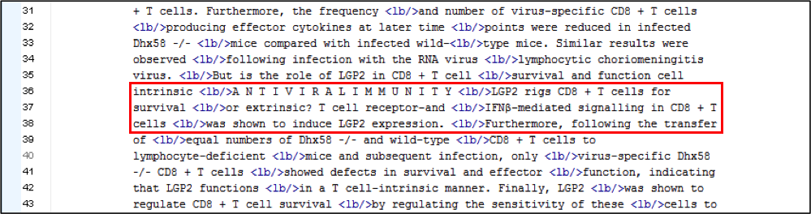
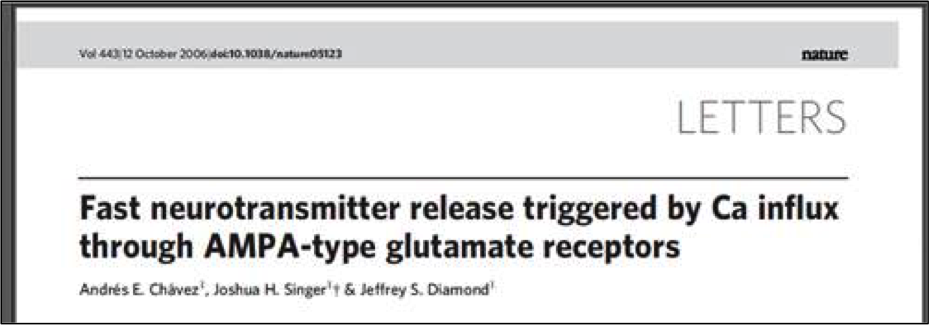
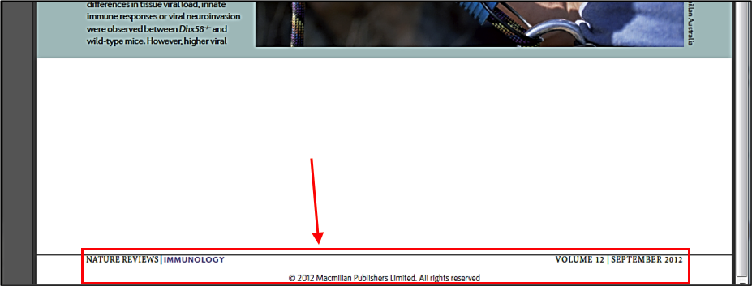
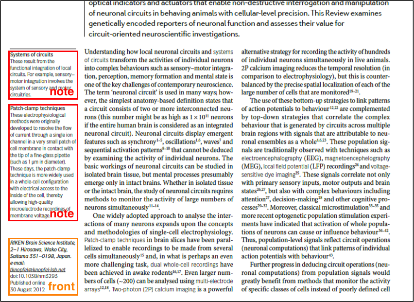
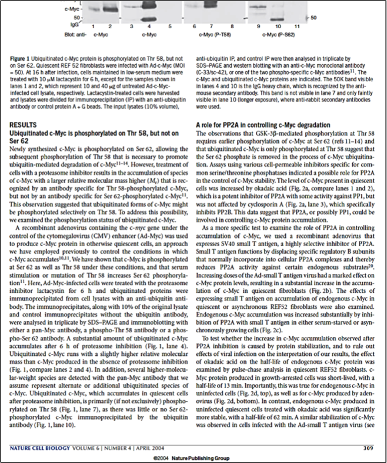

# Annotation guidelines for the 'segmentation' model

## Introduction

For the following guidelines, it is expected that training data has been generated as explained [here](../Training-the-models-of-Grobid/#generation-of-training-data).

The following TEI elements are used by the segmentation model:

* `<titlePage>` for the cover page
* `<front>` for the document header
* `<note place="headnote">` for the page header
* `<note place="footnote">` for the page footer and numbered footnotes
* `<body>` for the document body
* `<listBibl>` for the bibliographical section
* `<page>` to indicate page numbers
* `<div type="toc">` for table of content
* `<div type="acknowledgment">` for acknowledgment annex
* `<div type="availability">` for data and code availability statement annex (when not placed in the header)
* `<div type="funding">` for funding information annex (when not placed in the header)
* `<div type="annex">` for any other annexes

It is necessary to identify these above substructures when interrupting the `<body>`. Figures and tables (including their potential titles, captions and notes) are considered part of the body, so they are contained by the `<body>` element.

Note that the mark-up follows overall the [TEI](http://www.tei-c.org). 

> Note: It is highly recommended to study the existing training documents for the segmentation model first to see some examples of how these elements should be used.

## Analysis

The following sections provide detailed information and examples on how to handle certain typical cases.

### Start of the document (cover page and header)

#### Cover page

An optional cover page - usually added by the publisher to summarize the bibligraphical and copyright information - might be present, and need to be entirely identified by the `<titlePage>` element. The cover page is considered as an addition to a standalone well-formed article. The content of a cover page is usually redundant with the bibliographical information found in the article header. A cover page correspond usually to the content of the first entire page. 

#### Header (front)

The header section typically contains bibliographical information, such as document's title, author(s) possibly with affiliations, abstract, keywords, container journal title, etc. The header usually covers everything until the start of the article body (e.g. until reaching the introduction of the article). While a cover page is optional, an article should normally always include a header, even limited to the title. 

> Note that for the segmentation model, there aren't any `<title>` or `<author>` elements, because they are handled in the `header` model which is applied in cascaded at the next stage in the content identified by the segmentation model as "header".

All this material should be contained within the `<front>` element. In addition, any footnotes that are referenced from within the header (for example when author affiliations and addresses are expressed in footnotes) should also be annotated under a `<front>` element. Furthermore, the footer including the first page number should go in the header, because it indicates the first page of the article, which is a useful and common bibliographical information.  

In general, we expect as part of the header of the document to find all the bibliographical information of the document. This principle should be followed in every documents in order to ensure homogeneity of the "header" content across the training data.

Lines like the following, indicating bibliographical metadata, appearing as a footnote on the first page of the document should be contained inside a `<front>` element:
* Received: [date]
* Revised: [date]
* Accepted: [date]

However, any footnotes referenced from within the `<body>` should remain outside the header element, even if they are on the first page or surrunded by `<front>` fragments.

There should be as many `<front>` elements as necessary that contain all the contents identified as 'front contents' (bibliographical information), not necessarily limited to the first pages. The `<front>` can contain items that are not always at the beginning of the document, such as: 

* Copyright information / Open Access licence and statement
* Correspondence information 
* Detailed affiliation and address information
* Submission information, when was the document received, approved and published

These item elements are relatively frequently at the very end of an article or just after the document body. However, for consistency, they should be annotated under `<front>` because they are bibliographical information covered by the header model. 

The following information blocks sometimes appear inside the article header, so they should be annotated as `<front>`:  

* Author contributions
* Ethics and competing interests
* Funding 
* Data / code availability statement

However, they rather appear as annexes, after the document body. In this case, they should be annotated as "annex", see next section, and not under `<front>`.

It is possible that the position of a title in the text flow of a document can be different from the visual layout of the document. The following is an example of annotating the article title in such a case on the front page:



which Grobid initially recognized as follows:



The following TEI XML annotation shows the presence of a `front` element surrounding both the topic and the title:

```xml
virus. <lb/>But is the role of LGP2 in CD8 + T cell <lb/>survival and function cell
intrinsic <lb/></body>

<front>A N T I V I R A L I M U N I T Y <lb/>LGP2 rigs CD8 + T cells for
survival <lb/></front>

<body> or extrinsic? T cell receptor-and <lb/>IFNβ-mediated signalling in CD8 + T

```

> Note: In general, whether the `<lb/>` (line break) element is inside or outside the `<front>` or other elements is of no importance. However as indicated [here](General-principles/#correcting-pre-annotated-files), the <lb/> element should not be removed and should follow the stream of text. 

The following screenshot shows an example where an article starts mid-page, the end of the preceding one occupying the upper first third of the page. As this content does not belong to the article in question, don't add any elements and remove any `<front>` or `<body>` elements that could appear in the preceding article.


### Additional information (annex) 

Additional and supporting information sections, which are located **after the body** of the article (typically after the conclusion), should be annotated under `<div type="annex">` or the following more specific annex types:

* `<div type="acknowledgment">` for acknowledgment annex (including funding/grant acknowledgement when inside an acknowledgement section)
* `<div type="availability">` for data and code availability statement annex 
* `<div type="funding">` for funding information annex 

> Note: Different section of annex type should be segmented in separated `<div type="annex">` to capture the start and end of the different section blocks. 

Supplementary texts, supplementary figures and tables, and any similar appendix should be all encoded under `<div type="annex">`. 

### Elements interrupting the document body

Any information appearing in the page header needs to be surrounded by a `<note place="headnote">`.



The contents of the grey band in the screenshot above should be surrounded by a `<note place="headnote">` except on the first page where this type of information would be inside the `<front>` element.

Any information appearing in the page footer needs to be put inside a `<note place="footnote">`, as is shown in the following example:



Corresponding TEI XML:

```xml
<note place="footnote">NATURE REVIEWS | IMMUNOLOGY <lb/>VOLUME 12 |
	SEPTEMBER 2012 <lb/>© 2012 Macmillan Publishers Limited. All rights reserved</note>

```

The `<page>` element which contains the page number should be outside of any of the above `<note>` elements.

Any notes to the left of the main body text are to be encoded as `<note>` if they are related to an element of the `<body>`; if they concern header elements they go into a `<front>` element.  See this screenshot as an example:




### Tables and Figures

Figures and tables belong to the main body structure: they are not to be specifically encoded at the segmentation level.

Figures and table, including captions, appearing after the references but related to the body (e.g. list of figures in preprints), should be under `<body>`. If a figure or table appears inside an annex of an article, it should remain inside the `<div type="annex">` element. If a figure or table appears in an abstract (which is rare but might happen), this item should remain within the `<front>` element.

### Hidden characters

It happens that GROBID picks up hidden text that is present but not visible on the PDF's page for the reader (compare the XML below with the screenshot of the PDF page, the context being highlighted by red boxes); such content should not be surrounded by any element as to indicate to Grobid to ignore it.

```xml
visible in lane 10 (longer exposure), where anti-rabbit secondary antibodies<lb/> were used. <lb/></body>

print ncb1110 17/3/04 2:58 PM Page 309 <lb/>

<note place="footnote">© 2004 Nature Publishing Group <lb/></note>
```


