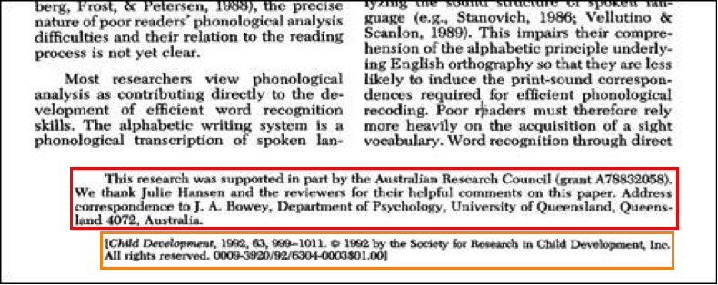
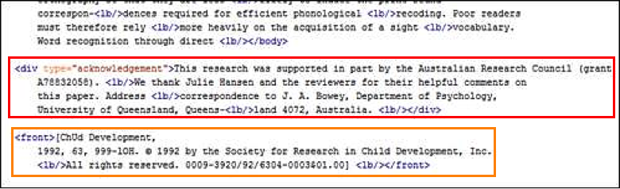

# Annotation guidelines for the 'segmentation' model

## Introduction

For the following guidelines, it is expected that training data has been generated as explained [here](../Training-the-models-of-Grobid/#generation-of-training-data).

The following TEI elements are used by the segmentation model:

* `<titlePage>` for the cover page
* `<front>` for the document header
* `<note place="headnote">` for the page header
* `<note place="footnote">` for the page footer
* `<body>` for the document body
* `<listBibl>` for the bibliographical section
* `<page>` to indicate page numbers
* `<div type="annex">` for annexes
* `<div type="acknowledgment">` for acknowledgments

It is necessary to identify these above substructures when interrupting the `<body>`. Figures and tables (including their potential titles, captions and notes) are considered part of the body, so contained by the `<body>` element.

Note that the mark-up follows overall the [TEI](http://www.tei-c.org). 

> Note: It is recommended to study the existing training documents for the segmentation model first to see some examples of how these elements should be used.

## Analysis

The following sections provide detailed information and examples on how to handle certain typical cases.

### Start of the document (front)

A cover page - usually added by the publish to summerize the bibligraphical and copyright information - might be present, and is entirely identified by the the `<titlePage>` element. 

The header section typically contains document's title, its author(s) with affiliations, an abstract and some keywords. All this material should contained within the `<front>` element, as well as any footnotes that are referenced from within the header (such as author affiliations and addresses). Furthermore, the footer including the first page number should go in there.  In general we expect as part of the header of the document to find all the bibliographical information for the article.  This should be followed in order to ensure homogeneity across the training data.

There should be as many `<front>` elements as necessary that contain all the contents identified as 'front contents'. Note that for the segmentation model, there aren't any `<title>` or `<author>` elements as they are handled in the `header` model which is applied in cascaded in a next stage.

Any footnotes referenced from within the `<body>` should remain there.

Lines like the following that appear as a footnote on the first page of the document should be contained inside a `<front>` element:
* Received: [date]
* Revised: [date]
* Accepted: [date]

The following is an example of correcting an appearance of the article title on the front page:


which Grobid initially recognized as follows:


The following, corrected bit of TEI XML shows the presence of a `front` element surrounding both the topic and the title:

```xml
virus. <lb/>But is the role of LGP2 in CD8 + T cell <lb/>survival and function cell
intrinsic <lb/></body>

<front>A N T I V I R A L I M U N I T Y <lb/>LGP2 rigs CD8 + T cells for
survival <lb/></front>

<body> or extrinsic? T cell receptor-and <lb/>IFNβ-mediated signalling in CD8 + T

```

> Note: In general, whether the `<lb/>` (line break) element is inside or outside the `<front>` or other elements is of no importance. However as indicated [here](General-principles/#correcting-pre-annotated-files), the <lb/> element should not be removed and should follow the stream of text. 

The following screen shot shows an example where an article starts mid-page, the end of the preceding one occupying the upper first third of the page. As this content does not belong to the article in question, don't add any elements and remove any `<front>` or `<body>` elements that could appear in the preceding article.


### Following document pages (body)

Any information appearing in the page header needs to be surrounded by a `<note place="headnote">`.


The contents of the grey band in the screenshot above should be surrounded by a `<note place="headnote">` except on the first page where this type of information would be inside the `<front>` element.

Any information appearing in the page footer needs to be put inside a `<note place="footnote">`, as is shown in the following example:


Corresponding TEI XML:

```xml
<note place="footnote">NATURE REVIEWS | IMMUNOLOGY <lb/>VOLUME 12 |
	SEPTEMBER 2012 <lb/>© 2012 Macmillan Publishers Limited. All rights reserved</note>

```

The `<page>` element which contains the page number should be outside of any of the above `<note>` elements.

Any notes to the left of the main body text are to be encoded as `<note>` if they are related to an element of the `<body>`; if they concern header elements they go into a `<front>` element.  See this screenshot as an example:


The following example shows a case where we have an acknowledgment (in the red frame) that gets encoded as a `<div type="acknowledgment">` whereas the title reference underneath (in the orange frame) is encoded using a `<front>` element.





### Tables and Figures

Figures and tables belong to the main body structure: they are not to be encoded specifically.

If a figure or table appears inside an annex of an article, it should remain inside the `<div type="annex">` element.

If a figure or table appears in an abstract (which is rare but it happens), this item should remain within the `<front>` element.


### Hidden characters

It happens that GROBID picks up hidden text that is present but not visible on the PDF's page for the reader (compare the XML below with the screenshot of the PDF page, the context being highlighted by red boxes); such content should not be surrounded by any element as to indicate to Grobid to ignore it.

```xml
visible in lane 10 (longer exposure), where anti-rabbit secondary antibodies<lb/> were used. <lb/></body>

print ncb1110 17/3/04 2:58 PM Page 309 <lb/>

<note place="footnote">© 2004 Nature Publishing Group <lb/></note>
```


